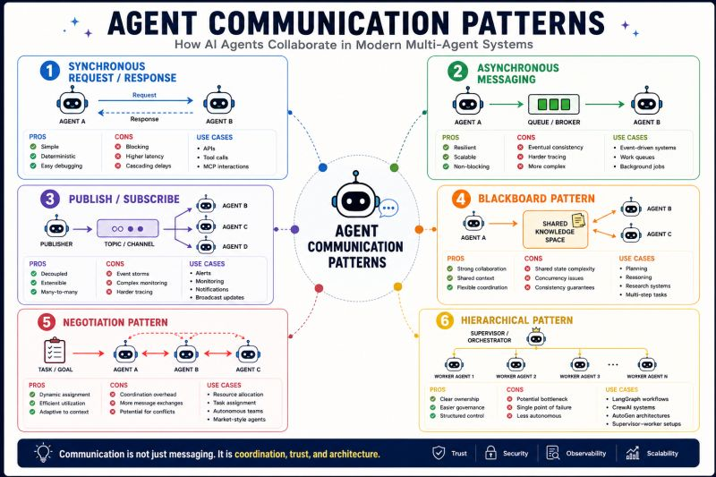

# Agent Communication Patterns

How AI agents collaborate in modern multi-agent systems.

## 🔵 Synchronous Request / Response

**Diagram:** Agent A ↔ Agent B

**Pros:**

- Simple
- Deterministic
- Easy debugging

**Cons:**

- Blocking
- Higher latency

**Use Cases:**

- APIs
- Tool calls
- MCP

## 🟢 Asynchronous Messaging

**Diagram:** Agent A → Queue → Agent B

**Pros:**

- Resilient
- Scalable

**Cons:**

- Eventual consistency
- Harder tracing

**Use Cases:**

- Event-driven systems
- Work queues

## 🟣 Publish / Subscribe

**Diagram:**

Publisher  
 ↓  
 Topic  
 ↓ ↓ ↓  
 Agent B C D

**Pros:**

- Decoupled
- Extensible

**Cons:**

- Event storms
- Complex monitoring

**Use Cases:**

- Alerts
- Monitoring
- Notifications

## 🟠 Blackboard Pattern

**Diagram:**

Agent A  
 Agent B → Shared Knowledge Space  
 Agent C

**Pros:**

- Collaboration
- Shared context

**Cons:**

- State management
- Concurrency issues

**Use Cases:**

- Planning
- Reasoning
- Research systems

## 🔴 Negotiation Pattern

**Diagram:**

Task  
 ↓  
 Agent A ↔ Agent B ↔ Agent C

**Pros:**

- Dynamic assignment
- Efficient utilization

**Cons:**

- Coordination overhead

**Use Cases:**

- Resource allocation
- Autonomous teams

## 🟡 Hierarchical Pattern

**Diagram:**

Supervisor  
 ↓ ↓ ↓  
 Worker Agents

**Pros:**

- Governance
- Control

**Cons:**

- Central bottleneck

**Use Cases:**

- LangGraph
- CrewAI
- AutoGen

---

*Originally published on [LinkedIn](https://www.linkedin.com/feed/update/urn:li:activity:7473989713557741568/), 20 June 2026.*
