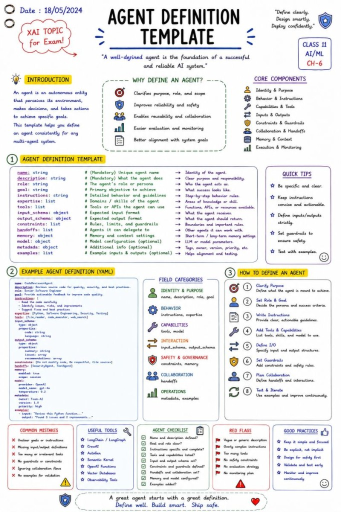

# Agent Definition Template

Agent templates, skills.md, and what well-defined agents actually need.

I use the early morning hours for upskilling.

It is the only part of the day when I can consistently dedicate two uninterrupted hours to deep learning—and honestly, I enjoy every minute of it.

This morning I took a deep dive into AI agent design, focusing on agent templates and skills.md files.

A few key observations:

✅ A well-defined agent starts with a clear identity:

- Name
- Description
- Role
- Goal

✅ Instructions are often more important than the model itself.

A strong agent definition establishes boundaries, expectations, and decision-making behavior.

✅ Tools are contracts.

An agent should know exactly:

- What tools it can use
- When to use them
- What inputs and outputs are expected

✅ Input and output schemas reduce ambiguity and improve reliability.

✅ Constraints and guardrails are not optional.

They are a core part of agent design, especially for enterprise AI systems.

✅ Handoffs matter.

Many real-world solutions are multi-agent systems where agents collaborate rather than trying to do everything themselves.

✅ The humble skills.md file is surprisingly powerful.

It allows knowledge, conventions, best practices, workflows, and project-specific guidance to be externalized and maintained separately from prompts.

One thing that became very clear:

Building effective AI agents is becoming less about prompt engineering alone and more about system design, contracts, governance, reliability, and architecture.

The more I learn about agentic systems, the more they remind me of classical software engineering principles—just applied to a new kind of software component.

What have you learned recently that changed the way you think about AI agents?

## Related notes

- [What Is an Agent?](what-is-an-agent.md)
- [Designing an Agent](designing-an-agent.md)

---

*Originally published on [LinkedIn](https://www.linkedin.com/feed/update/urn:li:activity:7473236946551681024/), 18 June 2026.*
