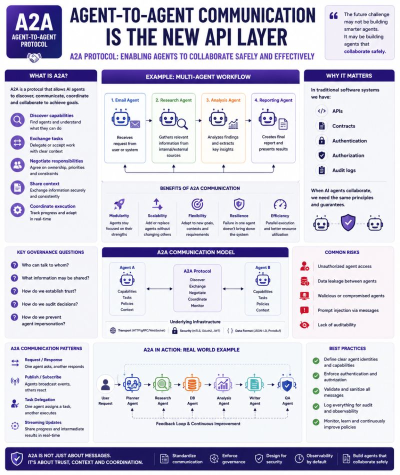

# Agent-to-Agent Protocol

Agent-to-agent communication is the new API layer.

🚨 Everyone is talking about AI Agents.

Far fewer people talk about what happens when agents start talking to each other.

In traditional software systems we have:

- APIs
- Contracts
- Authentication
- Authorization
- Audit logs

When AI agents collaborate, we need the same principles.

This is where Agent-to-Agent (A2A) protocols become interesting.

A2A is not simply "sending messages."

It is about enabling agents to:

- discover capabilities
- exchange tasks
- negotiate responsibilities
- share context
- coordinate execution

A simple example:

📧 Email Agent  
 → receives request

🔍 Research Agent  
 → gathers information

📊 Analysis Agent  
 → evaluates findings

📝 Reporting Agent  
 → creates final output

Without a communication protocol, every interaction becomes a custom integration.

Without governance, every interaction becomes a potential risk.

Questions quickly emerge:

- Who can talk to whom?
- What information may be shared?
- How do we establish trust?
- How do we audit decisions?
- How do we prevent agent impersonation?

The more I study agentic systems, the more A2A starts to resemble what APIs became for service-oriented architectures years ago.

Not because agents replace APIs.

But because they introduce a new coordination layer above them.

The future challenge may not be building smarter agents.

It may be building agents that collaborate safely.

## Related notes

- [Agent Communication Patterns](agent-communication-patterns.md)

---

*Originally published on [LinkedIn](https://www.linkedin.com/feed/update/urn:li:activity:7473587562734039111/), 19 June 2026.*
