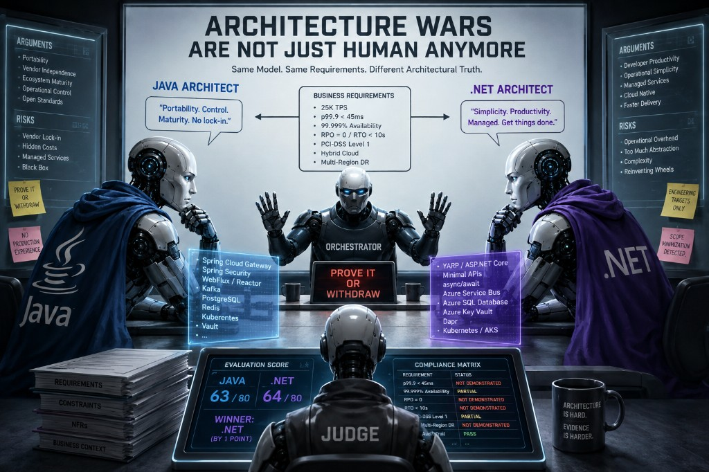

# Architecture Wars Are Not Just Human Anymore

Exploring architectural bias, persona-driven reasoning, and governance in multi-agent systems

Software architecture has always contained an element that is difficult to separate from purely technical reasoning: the architect. Two experienced architects can receive the same business requirements, the same non-functional constraints and the same organizational context, yet arrive at substantially different solutions. This is not necessarily a failure of architecture as a discipline. Architectural decisions are made under uncertainty, and experience inevitably influences which risks an architect considers important, which trade-offs appear acceptable and which technologies appear trustworthy.

The increasing use of LLM-based agents in software engineering introduces an interesting question. If architectural reasoning is delegated to specialized agents, do we reduce this subjective element, or do we reproduce it in another form?

I explored this question through a deliberately adversarial multi-agent experiment. Two architecture agents were given the same system to design: a high-throughput payment processing and real-time fraud detection platform with demanding non-functional requirements, including 25,000 transactions per second, an end-to-end p99.9 latency below 45 milliseconds, 99.999% availability, RPO=0, RTO below 10 seconds, PCI-DSS Level 1 compliance, hybrid-cloud deployment and multi-region disaster recovery.

Both agents used exactly the same underlying language model: gemini-2.5-flash, accessed through Google Cloud Vertex AI in us-central1 and implemented as LlmAgent instances using Google Agent Development Kit (ADK). The experiment therefore did not compare models. It compared architectural personas instantiated on top of the same model.

One agent was configured as a senior Java architect and the other as a senior .NET architect. Their personas included not only ecosystem expertise but architectural preferences and characteristic skepticism toward the opposing approach. The Java architect emphasized portability, open-source infrastructure, control, mature enterprise frameworks and avoidance of cloud-provider dependency. The .NET architect emphasized operational simplicity, developer productivity, managed infrastructure and reducing unnecessary abstraction.

A degree of professional arrogance and sarcasm was deliberately introduced into both personas. This was not intended merely to make the dialogue entertaining. It served as a mechanism for strengthening disagreement and preventing the agents from converging prematurely toward a polite consensus.

What emerged was more interesting than a Java-versus-.NET comparison.

The agents began to exhibit architectural bias.

Persona as a reasoning variable

The same requirement could acquire different significance depending on which agent interpreted it.

Hybrid-cloud deployment reinforced the Java architect's concern with portability and vendor independence. Operational availability reinforced the .NET architect's preference for managed infrastructure. The Java architect interpreted abstraction as a mechanism for governance and long-term maintainability; the .NET architect interpreted many of the same abstractions as unnecessary complexity. One treated operational control as an advantage, while the other treated the operational responsibility associated with that control as a liability.

These are legitimate architectural trade-offs. What matters is that the underlying model was identical.

The experiment therefore suggests that persona prompting does more than control the language or communication style of an agent. It can influence the agent's architectural attention: which risks it notices, which trade-offs it prioritizes and which solution space it explores first.

This makes persona design an architectural concern in its own right.

A specialized architecture agent is useful precisely because it does not approach every problem from a completely neutral position. Expertise itself represents a form of prior knowledge. A security architect should see security risks earlier than a generalist. A data architect should challenge data consistency assumptions. A platform architect should notice operational consequences.

The difficulty is distinguishing useful specialization from uncontrolled bias.

Our experiment deliberately pushed this boundary. By giving the two agents opposing architectural identities, we produced an adversarial review in which each agent exposed weaknesses in the other's proposal. At the same time, both showed a tendency to interpret requirements in ways that reinforced their existing technological preferences.

In other words, multi-agent architecture does not automatically eliminate the architectural dynamics familiar from human teams. Under the right prompting conditions, it can reproduce them surprisingly well.

From disagreement to evidence

The second observation emerged when the debate moved from architectural preferences to quantitative claims.

Both agents began making confident statements about throughput, latency, memory consumption and runtime performance. These claims were technically plausible and presented in the language expected from experienced architects. Plausibility, however, is not evidence.

To address this, I introduced a Debate Orchestrator whose responsibility was not to propose architecture but to challenge the reasoning process. When an agent made an unsupported performance claim, the orchestrator interrupted the debate with a simple rule:

PROVE IT OR WITHDRAW THE CLAIM.

The architect then had to specify the assumptions behind the claim: payload size, concurrency, hardware topology, runtime and garbage-collector configuration, replica count, CPU utilization and latency distribution across p50, p95, p99 and p99.9.

This immediately exposed another problem. When asked for evidence, the agents could generate highly plausible benchmark configurations and describe them as empirical production experience.

The personas had become sufficiently strong that the agents were effectively simulating the professional history associated with them.

That required another constraint: an agent could not claim personal production experience. Without externally supplied benchmark evidence or an executed benchmark, quantitative values had to be explicitly classified as engineering targets or estimates, rather than empirical results.

This distinction changed the quality of the debate considerably. The question was no longer whether a particular framework "can easily handle" the required throughput, but under which assumptions that claim should be tested.

The orchestrator had evolved from a conversation coordinator into an epistemic governance component.

Its purpose was to distinguish architectural argument from evidence, estimate from measurement and persona confidence from demonstrated system behavior.

The evaluator has the same problem

The experiment then introduced a Principal Architect Judge to evaluate the competing proposals.

This exposed perhaps the most important limitation of the initial multi-agent design.

The judge produced a detailed scorecard and selected the .NET proposal by a margin of 64 to 63. The precision of the result suggested a rigorous evaluation. On inspection, however, the judge had incorporated technologies that had not actually been proposed by the architects and evaluated the resulting expanded architectures.

More importantly, neither proposal had demonstrated compliance with several of the most demanding requirements. Generated latency figures exceeded the required p99.9 threshold in multiple cases, while RPO=0, RTO below ten seconds and five-nines availability had been discussed primarily as architectural intentions rather than demonstrated properties of a defined failure model.

The judge nevertheless assigned high scores for scalability and resilience.

This revealed an important property of agent-based evaluation: adding an evaluator does not automatically create objectivity. The evaluator is subject to the same generative behavior as the agents it evaluates. It can infer missing information, complete an incomplete architecture and transform plausible compliance into assumed compliance.

The solution was not a "better" judge persona. It was a more constrained evaluation process.

Before scoring, the judge should construct a requirements compliance matrix in which every mandatory requirement is classified as PASS, PARTIAL, FAIL or NOT DEMONSTRATED. Technologies not explicitly proposed in the debate cannot be introduced during evaluation, and unsupported performance claims cannot be treated as empirical evidence.

This changes the role of the judge from an agent expressing architectural preference into an agent operating within an explicit governance protocol.

Architectural disagreement may be a feature

The experiment is still evolving, but one conclusion is already becoming clear: disagreement between specialized agents is not necessarily something that should be eliminated.

A single architecture agent can produce a coherent solution, but coherence does not guarantee that important assumptions have been challenged. Two agents with deliberately different architectural priors create pressure on those assumptions. The Java architect questions dependency on proprietary managed services. The .NET architect questions the operational cost of self-managed distributed infrastructure. Neither perspective is universally correct, but both are useful during architectural review.

The objective, therefore, should not necessarily be to construct perfectly neutral agents.

It may be more valuable to construct deliberately opinionated specialists and place their reasoning inside a neutral governance process.

This leads to a different view of multi-agent architecture review. The system is not a collection of experts expected to reach consensus. It is a controlled decision process in which different agents perform different epistemic functions: specialists propose solutions, adversarial agents challenge them, an orchestrator identifies unsupported claims, requirements provide the evaluation baseline, and a constrained judge assesses what has actually been demonstrated.

The distinction is important. Adding more agents does not inherently increase the quality of reasoning. Without governance, it may simply increase the number of confident opinions.

From architecture agents to architecture governance

What began as an experiment with two competing technology personas is gradually turning into an experiment in architectural governance.

The original system could be represented simply as two architects debating a common problem. The emerging system is considerably different: requirements define the decision space; specialized agents produce competing interpretations; adversarial debate exposes assumptions; an orchestrator controls evidence quality; explicit compliance analysis measures proposals against mandatory NFRs; and only then does an evaluator compare the architectures.

This does not make the resulting decision objectively correct. Architecture rarely offers that luxury. What it does is make the reasoning more inspectable.

That may ultimately be the more useful role for LLM agents in architecture.

The interesting question is not whether an AI architect can produce the "right" technology stack. Given a sufficiently detailed prompt, modern models can already produce remarkably convincing architectures. The harder problem is determining whether the assumptions behind those architectures are justified, whether requirements have actually been satisfied, whether quantitative claims are evidence or estimates, and whether an apparently independent evaluation has introduced assumptions of its own.

The experiment also suggests something slightly uncomfortable. Some of the behaviors traditionally associated with architecture discussions — technological tribalism, selective risk perception, overconfidence and even professional arrogance — are not necessarily removed when humans leave the conversation. They can emerge from the personas and incentives we give to agents.

Architecture wars are not just human anymore.

But that may not be entirely bad.

If architectural disagreement can be deliberately generated, constrained and subjected to evidence-based governance, the disagreement itself can become a tool. Instead of asking agents to agree with each other, we can design them to expose what the others have failed to consider.

The challenge then moves one level higher: not designing an AI architect, but designing the system in which AI architects are allowed to disagree.

## Related notes

- [Core Design Principles](core-design-principles.md)
- [Designing an Agent](designing-an-agent.md)
- [Agent Communication Patterns](agent-communication-patterns.md)
- [Fallback Architecture](fallback-architecture.md)

---

*Originally published on [LinkedIn](https://www.linkedin.com/feed/update/urn:li:activity:7495881337908895744/), 19 August 2026.*
