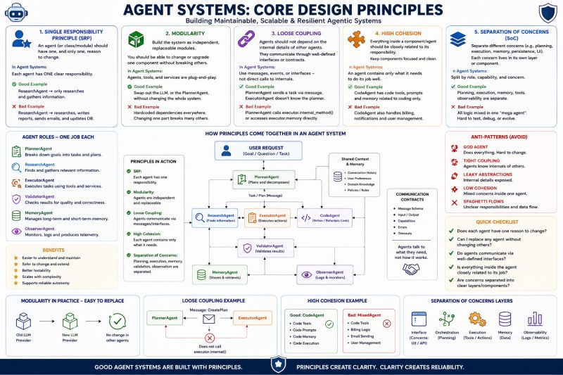

# Core Design Principles

Agent systems are built on architecture — not prompts.

🏗️ Agent Systems Are Not Built on Prompts. They Are Built on Architecture.

As AI agents become more autonomous, many teams focus on models, prompts, tools, and frameworks.

But most production failures don't come from the LLM.

They come from poor system design.

The same engineering principles that helped us build scalable software are now becoming essential for agent systems.

🎯 Single Responsibility Principle (SRP)  
 Each agent should have one clear job.

🧩 Modularity  
 Models, tools, and services should be replaceable without redesigning the system.

🔗 Loose Coupling  
 Agents should communicate through contracts and interfaces, not internal implementation details.

🧠 High Cohesion  
 Everything inside an agent should be related to its purpose.

🏛️ Separation of Concerns  
 Planning, execution, memory, observability, and governance belong in separate layers.

Common Agentic Anti-Patterns

❌ The "God Agent" that does everything

❌ Agents directly accessing each other's internals

❌ Shared mutable memory everywhere

❌ Mixing orchestration and business logic

❌ No validation layer

❌ No observability

❌ No fallback strategy

A simple architecture test:

✔ One responsibility per agent

✔ Replaceable components

✔ Clear communication contracts

✔ Focused agent responsibilities

✔ Clear separation of concerns

The future of AI systems is not unlimited autonomy.

It is a collection of small, focused, replaceable agents working together through clear responsibilities, interfaces, and guardrails.

---

*Originally published on [LinkedIn](https://www.linkedin.com/feed/update/urn:li:activity:7470692693376028672/), 11 June 2026.*
