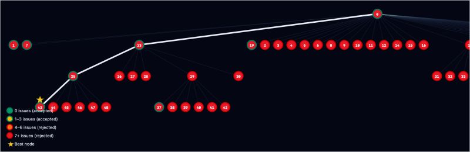

# Darwin Gödel Machine

From Transcendence to self-improving code.

2014 there was this movie Transcendence. 🤯 Genius movie. People in my inner circle were not able to grasp the genius behind the movie. But today we are lucky to observe concepts to be implemented. The most fascinating concepts back then was the self improving agents. Once the self of the main character was uploaded into the server, the first thing he did was to improve it's code. A groundbreaking paper was published last year about Darwin Gödel Machine(DGM). It's mesmerising concept. You build an agent which improves it code. The key is that it needs to proof mathematically that the new mutation is actually an evolution. My benchmark shows 85% improved java code( I decided to use Google Java Style Guide) 💫 . Currently it is just a research phase and pure fun to code something like this but honestly I would love to see this working on production one day! Disclaimer: when I use LLMs the models are improving the outcome with 10%. Groundbreaking.

P.S. The image is taken from one of my experiments.

P.S. after the P.S. Yes, I am excited to discuss technologies and I don't see this as downside of my personality! 🤷🏼‍♀️

---

*Originally published on [LinkedIn](https://www.linkedin.com/feed/update/urn:li:activity:7455947713923350528/), 1 May 2026.*
