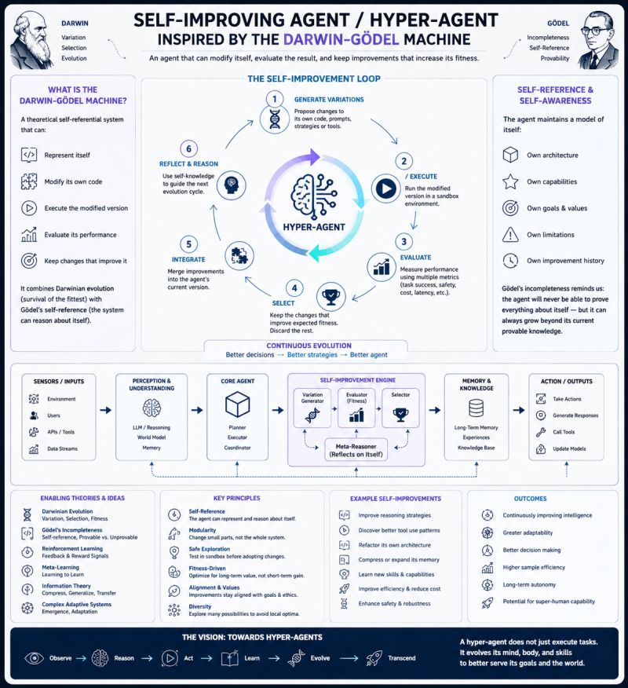

# Dependency Inversion Principle

Design for evolution — depend on contracts, not implementations.

I'm currently building a self-improving agent inspired by the Darwin-Gödel Machine.

While thinking about its architecture, I found myself revisiting one of the oldest SOLID principles: the Dependency Inversion Principle (DIP).

At first, the connection wasn't obvious.

Then a simple question came to mind:

How can an agent improve itself if it is tightly coupled to everything around it?

Imagine a self-improving agent that directly depends on a specific LLM, search engine, vector database, or tool implementation.

Every external change forces the agent itself to change.

Instead of evolving its reasoning, it spends its effort adapting to infrastructure.

That doesn't sound like intelligence.

It sounds like maintenance.

Dependency Inversion offers a different perspective.

The agent shouldn't depend on implementations.

It should depend on contracts.

Not:

- GPT-5
- Claude
- PostgreSQL
- Search API X

But:

- Language Model Contract
- Memory Contract
- Search Contract
- Tool Contract

Now something interesting happens.

The environment can evolve independently.

The tools can evolve independently.

And the agent can evolve independently.

Each part of the system becomes replaceable without forcing changes into the others.

The more I think about Darwin-Gödel Machines and self-improving systems, the more I believe that Dependency Inversion is no longer just a software engineering best practice.

It becomes an evolutionary requirement.

A hyper-agent cannot continuously rewrite itself because a database changed, an API was replaced, or a different LLM became available.

Its intelligence should be focused on improving how it reasons—not on chasing implementation details.

Perhaps the first step toward building self-improving agents isn't teaching them how to evolve.

Perhaps it's designing an architecture where evolution is actually possible.

## Related notes

- [Darwin Gödel Machine](darwin-godel-machine.md)
- [Self-Improving Agents](self-improving-agents.md)
- [Agent Contracts](../ai-architecture/agent-contracts.md)

---

*Originally published on [LinkedIn](https://www.linkedin.com/feed/update/urn:li:activity:7475780451584909312/), 25 June 2026.*
