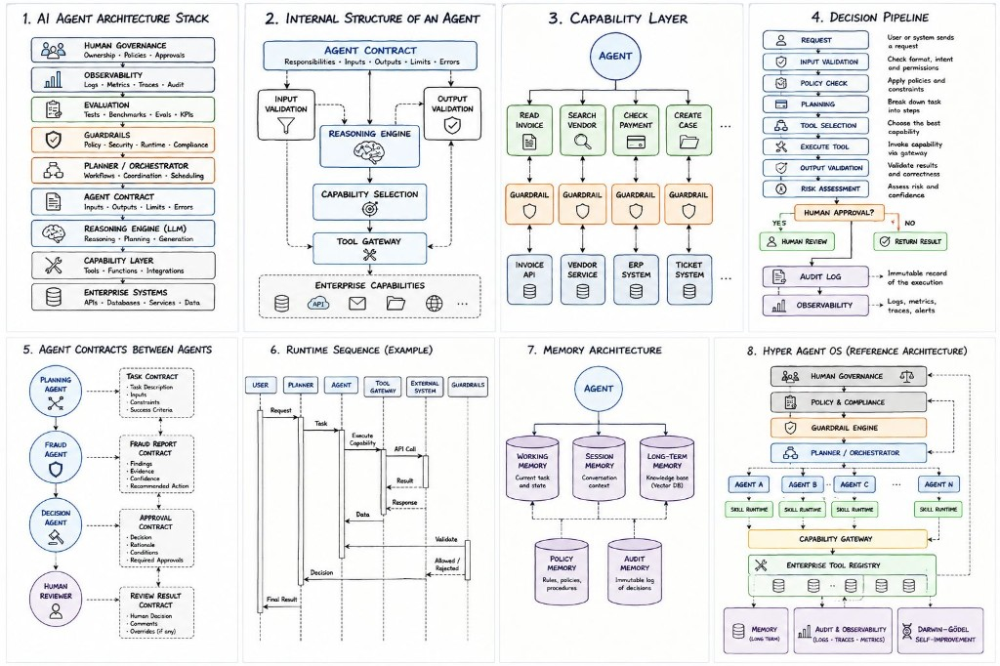

# Designing an Agent

Suppose I have to design an agent.

The first thing I need is its boundary.

Without a boundary, there is no way to define its responsibility. Without a responsibility, there is no contract. Without a contract, there is no way to know which capabilities belong to the agent and which don't.

That immediately defines the next problem.

How does the rest of the system interact with the agent?

Not through prompts.

Through a contract.

At that point the prompt becomes an implementation detail.

The contract doesn't.

The next question is capabilities.

Should the agent call APIs directly?

Should it know where data comes from?

Should it invoke other agents?

Or should all of that be hidden behind a capability layer?

Now guardrails become interesting.

If capabilities are bounded, then guardrails are no longer a validation step. They become constraints on how those capabilities may be used.

Planning becomes another architectural concern.

Does every agent own its own planning?

Or is planning centralized?

If planners and executors are mixed together, coupling increases immediately.

Finally comes observability.

If I cannot explain why an agent selected one capability instead of another, I don't really understand the system I built.

Only after answering those questions would I start writing prompts.

## Related notes

- [What Is an Agent?](what-is-an-agent.md)
- [Agent Definition Template](agent-definition-template.md)
- [Fallback Architecture](fallback-architecture.md)

---

*Originally published on [LinkedIn](https://www.linkedin.com/feed/update/urn:li:activity:7479093936666636288/), 4 July 2026.*
