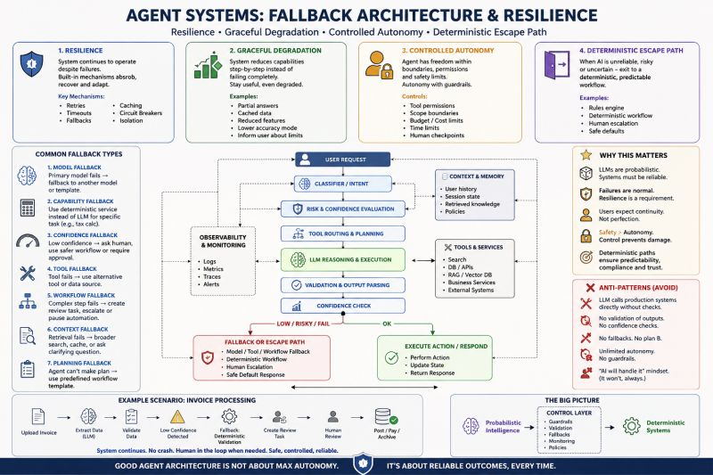

# Fallback Architecture

Maximum reliability under uncertainty — not maximum autonomy.

Most discussions around AI agents focus on autonomy.

In production systems, the real engineering challenge is usually the opposite:

How do you constrain agents safely when things go wrong?

Because they will go wrong.

LLMs are probabilistic systems operating inside deterministic infrastructures.

That mismatch creates one of the core architectural problems of modern AI systems.

A mature AI architecture is not built around "perfect reasoning."

It is built around fallback strategies.

🔹 Resilience

The system continues operating under failure conditions.

Not:

"Prevent all failures."

But:

"Survive failures gracefully."

Examples:

- model failover
- retry orchestration
- timeout handling
- parser recovery
- circuit breakers
- cache recovery
- tool isolation

A resilient agent system assumes:

- providers will fail
- tools will fail
- outputs will break
- latency will spike
- context windows will overflow

And designs for that reality upfront.

---

🔹 Graceful degradation

The system loses capabilities progressively instead of collapsing entirely.

Example:

If retrieval fails:

- fallback to keyword search
- fallback to cached context
- fallback to partial response
- fallback to human clarification

Instead of:

"Internal server error."

This becomes especially critical in:

- RAG systems
- multi-agent orchestration
- tool-heavy architectures
- enterprise copilots

---

🔹 Controlled autonomy

Probably the most misunderstood concept in AI engineering today.

Enterprise systems rarely want "fully autonomous agents."

They want:

bounded autonomy.

Meaning:

- scoped permissions
- action boundaries
- approval checkpoints
- execution limits
- policy enforcement
- cost controls
- human escalation paths

A production agent should not freely:

- deploy code
- execute payments
- delete records
- trigger infrastructure changes

without deterministic controls around it.

Modern agents are usually:

semi-autonomous workflow orchestrators.

Not AGI employees.

---

🔹 Deterministic escape paths

This is where architecture becomes extremely interesting.

When AI reasoning becomes:

- uncertain
- risky
- expensive
- non-compliant
- low-confidence

the system exits probabilistic behavior entirely.

Example:

LLM:

"Estimated VAT might be 18%."

Fallback:

Route to deterministic tax engine.

Or:

LLM:

"Low confidence extraction."

Fallback:

Create human review task.

This pattern appears everywhere:

- finance
- healthcare
- cybersecurity
- compliance systems
- regulated AI

The most important realization:

Production AI systems are increasingly becoming:

Probabilistic intelligence

wrapped inside

deterministic control systems.

The future is probably not:

"maximum autonomy."

It is:

"maximum reliability under uncertainty."

---

*Originally published on [LinkedIn](https://www.linkedin.com/feed/update/urn:li:activity:7470330502986600449/), 10 June 2026.*
