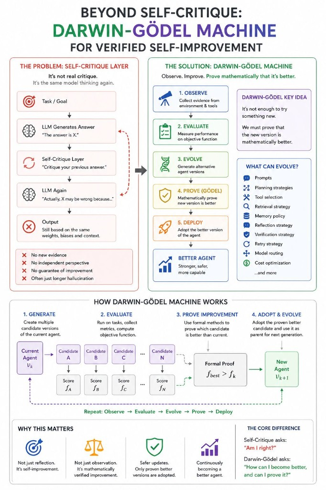

# Self-Improving Agents

Beyond reflection: from self-critique to verified self-improvement.

I was reading a book on agent architectures when I stumbled upon the term **Self-Critique Layer**. It immediately caught my attention. The more I thought about it, the more it felt like one of those concepts that sounds much more powerful than it actually is.

## Self-critique is not real critique

Think about what usually happens:

```
Agent → LLM → "Critique your previous answer."
```

But who is performing the critique? The same model. The same weights. The same reasoning process. Often with exactly the same context.

Is that really critique? Or is it simply another inference pass?

A self-critique layer does not introduce new evidence. It does not introduce an independent perspective. It does not validate against reality. It simply asks the model to think again. That may improve some responses, but it does not fundamentally improve the agent.

## A different question: Darwin-Gödel Machine

While reading that chapter, my mind immediately jumped to the **Darwin-Gödel Machine** — because it shifts the question entirely.

Instead of asking: *"Can I produce a better answer?"*

it asks: *"Can I become a better agent?"*

That distinction is profound.

The Darwin-Gödel Machine does not stop at observing its own performance. It generates alternative versions of itself, evaluates them against measurable objectives, and evolves its own architecture. More importantly, it introduces something that today's reflection-based agents largely lack: **a mechanism to justify that a modification is actually an improvement**.

In the original Gödel Machine, self-modifications are accepted only after a formal proof that the change increases the expected utility according to its objective function.

The Darwin-Gödel Machine extends this idea with evolutionary search, allowing the system to explore many candidate improvements while still requiring rigorous evidence before adopting them.

That is fundamentally different from asking an LLM to "think again."

- **Reflection** — the model reconsiders its output.
- **Verified self-improvement** — the system proves the change is better before adopting it.



## Evolution Layer

Perhaps the future of agent architectures is not another Reflection Layer or Self-Critique Layer.

Perhaps it is an **Evolution Layer** — one that continuously redesigns the agent, validates every modification, and only adopts changes that can be demonstrated to improve its performance.

To me, that is where autonomous agents become truly interesting.

## Recommended

- [Darwin Gödel Machine Explained: Self-Improving AI Agents](https://www.youtube.com/watch?v=KptCerr9D5I) — AI Papers Academy

---

*Originally published on [LinkedIn](https://www.linkedin.com/feed/update/urn:li:activity:7486379235914407936/), 24 July 2026.*
