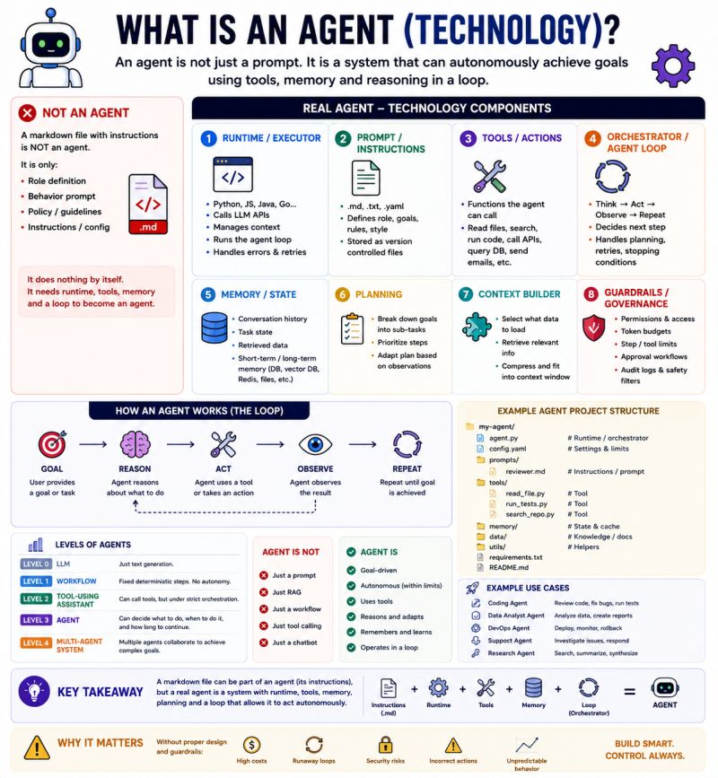

# What Is an Agent?

A markdown file is not the agent — it is only the instruction sheet.

🚨 One of the biggest buzzwords in AI right now is:

 "Agent".

At conferences, I increasingly see people showing:

 📄 a markdown file

 📄 a YAML config

 📄 a system prompt

…and calling it:

 🤖 "an AI agent".

But a .md file alone is not an agent.

It is usually just:

instructions

role definition

behavior configuration

prompt template

Useful?

 Absolutely.

But the actual agent is the SYSTEM around it.

A real agent usually combines:

⚙️ Runtime / Executor

 Typically Python, JS, Java, Go, etc.

 This is what actually runs the logic.

🧠 LLM

 The reasoning engine.

🛠️ Tools

 File access, APIs, search, databases, code execution, email, workflows…

🔄 Agent Loop / Orchestrator

 The important part:

 Observe → Reason → Act → Observe again

💾 Memory / State

 Conversation history, retrieved context, task state, vector DB, cache…

📋 Planning Layer

 Breaks goals into subtasks and adapts dynamically.

🧱 Guardrails & Governance

 Permissions, token budgets, approval flows, logging, safety limits.

This is why I think the industry is creating confusion.

Many things called "agents" today are actually:

prompt chains

workflows

tool-calling assistants

RAG pipelines

—not truly autonomous systems.

The important distinction is:

A workflow follows predefined steps.

An agent can dynamically decide:

what to do

which tool to use

when to retry

when to stop

how to adapt

And that autonomy changes everything.

Because once you introduce:

loops

tools

memory

reasoning

autonomy

you also introduce:

 ⚠️ cost explosions

 ⚠️ prompt injection risks

 ⚠️ runaway execution

 ⚠️ unpredictable behavior

 ⚠️ governance challenges

Ironically:

 the hardest part of building agents is often not intelligence.

It is:

 🎯 control

 🎯 observability

 🎯 constraints

 🎯 safety

Which is why I increasingly think:

 Agent Engineering is becoming closer to:

distributed systems engineering

security engineering

workflow orchestration

governance design

than "just prompting an LLM".

A markdown file is not the agent.

It is only the instruction sheet.

The real agent is the runtime system operating around it.

---

*Originally published on [LinkedIn](https://www.linkedin.com/feed/update/urn:li:activity:7468953855318319104/), 6 June 2026.*
