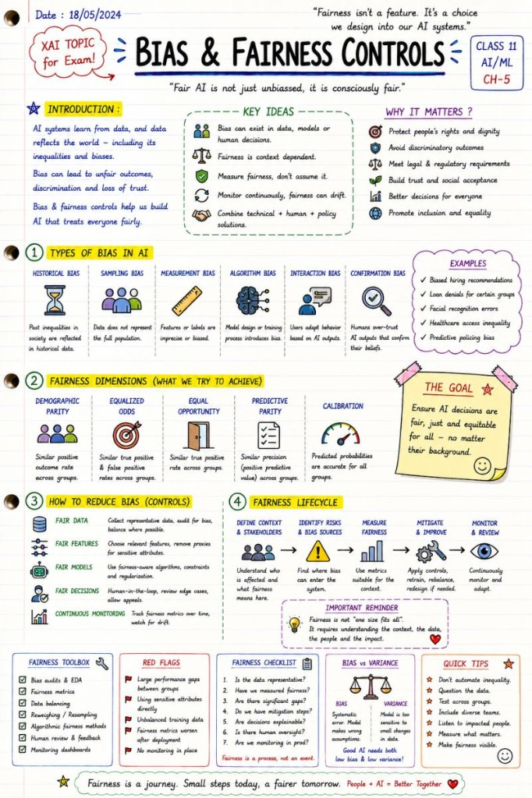

# Bias & Fairness Controls

Fairness cannot be added at the end of the project.

🚨 AI systems are not automatically fair.

They learn from data.

And data reflects the real world — including:

historical inequalities

social biases

incomplete representation

human decisions

systemic imbalances

That means AI can unintentionally amplify discrimination at scale.

This is why:

 🎯 Bias & Fairness Controls

 are becoming one of the most important pillars of Responsible AI.

Especially in:

hiring systems

banking & credit scoring

insurance

healthcare

education

law enforcement

Because when AI is unfair,

 the impact is no longer "just technical."

It becomes:

 ⚠️ social

 ⚠️ ethical

 ⚠️ legal

 ⚠️ reputational

One of the biggest misconceptions in AI is:

 "If we remove sensitive attributes, the model becomes fair."

Unfortunately, fairness is much more complicated.

AI systems can still learn proxies through:

ZIP codes

language patterns

purchasing behavior

education history

browsing habits

correlated features

Which means:

 bias can remain hidden even when explicit sensitive fields are removed.

That's why modern AI fairness work increasingly includes:

 ✅ Bias audits

 ✅ Representative datasets

 ✅ Fairness metrics

 ✅ Demographic testing

 ✅ Human oversight

 ✅ Continuous monitoring

 ✅ Explainability (XAI)

 ✅ Governance & documentation

And fairness itself is not one-dimensional.

Different fairness definitions can even conflict with each other:

demographic parity

equal opportunity

equalized odds

predictive parity

Meaning:

 there is rarely a single "perfectly fair" solution.

Fairness is often:

 📌 contextual

 📌 domain-specific

 📌 value-dependent

This is one reason why the EU AI Act places strong attention on:

bias mitigation

data governance

transparency

accountability

human oversight

What I personally find fascinating:

 Bias & Fairness is no longer only a machine learning problem.

It sits at the intersection of:

AI engineering

ethics

sociology

law

governance

product design

And perhaps the most important shift is this:

Fairness cannot be added at the end of the project.

It has to be designed into the system from the beginning.

Responsible AI is not about building "perfect AI."

It's about building systems that are:

 aware, measurable, transparent and continuously improvable.

People + AI > AI alone.

## Related notes

- [Overfitting in Business](../machine-learning/overfitting-in-business.md)
- [Logging & Auditability](logging-and-auditability.md)
- [High-Risk AI Systems](high-risk-ai-systems.md)

---

*Originally published on [LinkedIn](https://www.linkedin.com/feed/update/urn:li:activity:7467438599685406720/), 2 June 2026.*
