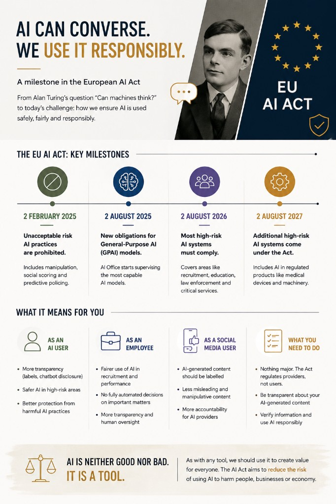

# EU AI Act Implementation

From Alan Turing to GPAI obligations — what the phased rollout means for users, employees and social media.

Long ago, while I was at university, Alan Turing was mentioned on many occasions, especially during the Artificial Intelligence course.

You have probably heard of him. He was a British mathematician, logician and cryptanalyst. During World War II, he worked at Bletchley Park, where he played a leading role in breaking the German Enigma cipher.

His work at Bletchley Park contributed significantly to the Allied war effort and is widely believed to have shortened the war, saving countless lives.

Besides his contributions to cryptography, Turing also introduced the Imitation Game in his 1950 paper Computing Machinery and Intelligence. The name Turing Test became popular later.

The idea behind it is an experiment in which a human judge tries to distinguish between a machine and another human through conversation alone. If the judge cannot reliably tell them apart, the machine is said to have passed the test.

For decades, the Turing Test remained largely a thought experiment and a benchmark for measuring progress in Artificial Intelligence. Today, however, we are no longer asking whether machines can convincingly imitate humans. We are asking how such systems should be developed, deployed and governed responsibly.

That is precisely where the European AI Act comes in.

Today marks another important milestone in the phased implementation of the European AI Act.

Starting today:

General-Purpose AI (GPAI) models, including foundation models and Large Language Models (LLMs), become subject to new regulatory obligations.

The European AI Office receives expanded powers to supervise the most capable AI models and to request information from their providers when necessary.

Companies developing and deploying AI systems must comply with additional transparency requirements. AI-generated content, including deepfakes, must be appropriately disclosed, and users should be informed when they are interacting with an AI system rather than a human.

Member States must have designated competent national authorities responsible for supervising and enforcing the AI Act.

The enforcement framework is now operational, meaning organisations that fail to comply with the applicable provisions may face significant administrative fines, reaching up to €35 million or 7% of their worldwide annual turnover, whichever is higher.

The AI Act is not applied all at once. Instead, it follows a phased implementation:

2 February 2025 – AI practices considered to pose an unacceptable risk, such as certain forms of manipulation, social scoring and profiling-based predictive policing, become prohibited.

2 August 2025 – Providers of General-Purpose AI models become subject to new obligations, and the European AI Office begins supervising the most capable AI models.

2 August 2026 – Most high-risk AI systems used in areas such as recruitment, education, law enforcement, migration, access to essential public services and critical infrastructure must comply with the AI Act.

2 August 2027 – Additional high-risk AI systems already regulated under existing EU product safety legislation, such as certain medical devices and machinery containing AI, also become subject to the AI Act.

What does this mean for me as an AI user?

If you use ChatGPT, Claude, Gemini, Copilot or any other AI assistant, you probably won’t notice dramatic changes overnight. However, over the coming months and years you are likely to see several differences:

More transparency. AI-generated content, including deepfakes, should be clearly identified, making it easier to distinguish synthetic content from human-created content.

Clearer disclosure. You should be informed when you are interacting with an AI system rather than a human, for example when using customer support chatbots.

Safer AI systems. AI used in high-risk domains such as healthcare, recruitment, education, banking and law enforcement will be subject to stricter requirements regarding risk management, human oversight, accuracy, robustness and cybersecurity.

Greater accountability. Companies developing or deploying AI systems will need to document their systems, manage risks and demonstrate compliance with the AI Act.

Better protection of fundamental rights. Certain AI practices considered to pose an unacceptable risk, such as social scoring or specific forms of manipulative AI, are prohibited within the European Union.

For most users, the AI Act will not change how they interact with AI on a daily basis. Instead, its primary goal is to make AI systems more transparent, trustworthy and accountable while reducing risks in areas where AI decisions can have a significant impact on people’s lives.

What does this mean for me as an employee?

If your employer uses AI, the AI Act is likely to affect you even if you never build AI systems yourself.

Here are a few examples:

* Recruitment. If AI is used to screen CVs, rank candidates or recommend who should be interviewed, those systems are considered high-risk and must comply with strict regulatory requirements.
* Performance evaluation. Employers cannot rely solely on AI to make decisions about promotions, dismissals or employee evaluations. Human oversight becomes a key requirement for high-risk AI systems.
* Workplace monitoring. AI systems that analyse employee behaviour, productivity or communications will be subject to greater scrutiny. Some uses, such as emotion recognition in the workplace, are prohibited under the AI Act.
* Greater transparency. Employees should be informed when AI plays a significant role in decisions that affect them, rather than assuming every decision was made entirely by a human.
* Better accountability. Organisations will need to document how their AI systems work, assess risks and demonstrate compliance. This makes it easier for regulators to investigate AI-assisted decisions when necessary.

For most employees, the AI Act will not change their daily work overnight. Instead, it aims to ensure that when AI is used to make decisions that can significantly affect people’s careers or working conditions, those systems are transparent, reliable and subject to meaningful human oversight.

What does this mean for me as a social media user?

Whether you use LinkedIn, Facebook, Instagram, TikTok or X, you are likely to notice some changes over time.

* More AI-generated content will be labelled. Images, videos and audio created or significantly modified by AI—especially deepfakes—should be disclosed more clearly, helping users distinguish between authentic and synthetic content.
* Less misleading content. The AI Act aims to reduce the misuse of AI for deception, impersonation and manipulation, particularly where AI-generated content could influence people’s decisions.
* Greater transparency. In some situations, you should be informed when you are interacting with an AI system rather than a human, such as customer support chatbots or AI-powered assistants.
* Better protection against harmful AI practices. Certain AI systems that manipulate people’s behaviour or exploit vulnerable individuals are prohibited under the AI Act.
* More accountability for AI providers. Companies developing and deploying AI systems will be expected to document their models, assess risks and comply with regulatory requirements, making them more accountable for the technologies they release.

The AI Act will not eliminate fake news, misinformation or AI-generated content from social media. However, it establishes rules that make AI systems more transparent and places greater responsibility on organisations developing and deploying them.

What do I need to do?

For most people, the answer is nothing.

The AI Act primarily regulates organisations that develop, provide or deploy AI systems—not the people who use them.

However, there are a few good practices worth following:

* Be transparent. If you publish AI-generated images, videos or audio, clearly disclose that they were created or significantly modified using AI.
* Verify AI-generated content. Large Language Models can make mistakes, and AI-generated images or videos can be misleading. Always verify important information before sharing or acting on it.
* Use AI responsibly. Avoid using AI to impersonate others, spread misinformation or create deceptive content.
* Understand AI’s limitations. AI can be an excellent assistant, but it should not replace human judgement in important decisions involving health, finance, legal matters or employment.

For the vast majority of AI users, the AI Act does not introduce new obligations. Instead, it aims to ensure that the organisations building and deploying AI systems do so in a transparent, safe and accountable way.

AI is neither good nor bad. It is a tool.

Like any other tool, its impact depends on how we choose to use it. In the right hands, AI can help us solve complex problems, improve healthcare, accelerate scientific research, increase productivity and create value for individuals, businesses and society.

At the same time, every powerful technology can be misused. The purpose of the AI Act is not to slow down innovation or prevent the adoption of AI. Its goal is to reduce the risks associated with AI and to establish clear rules that help protect people, businesses and the economy from harmful or irresponsible uses of the technology.

Ultimately, trust is one of the key factors that will determine how successfully AI is adopted. Regulations such as the AI Act aim to ensure that innovation and responsibility evolve together.

## Related notes

- [High-Risk AI Systems](high-risk-ai-systems.md)
- [Risk Management](risk-management.md)
- [Human-in-the-Loop](human-in-the-loop.md)
- [Monitoring & Post-Market Surveillance](monitoring-and-post-market-surveillance.md)

---

*Originally published on LinkedIn, 2 August 2026.*
