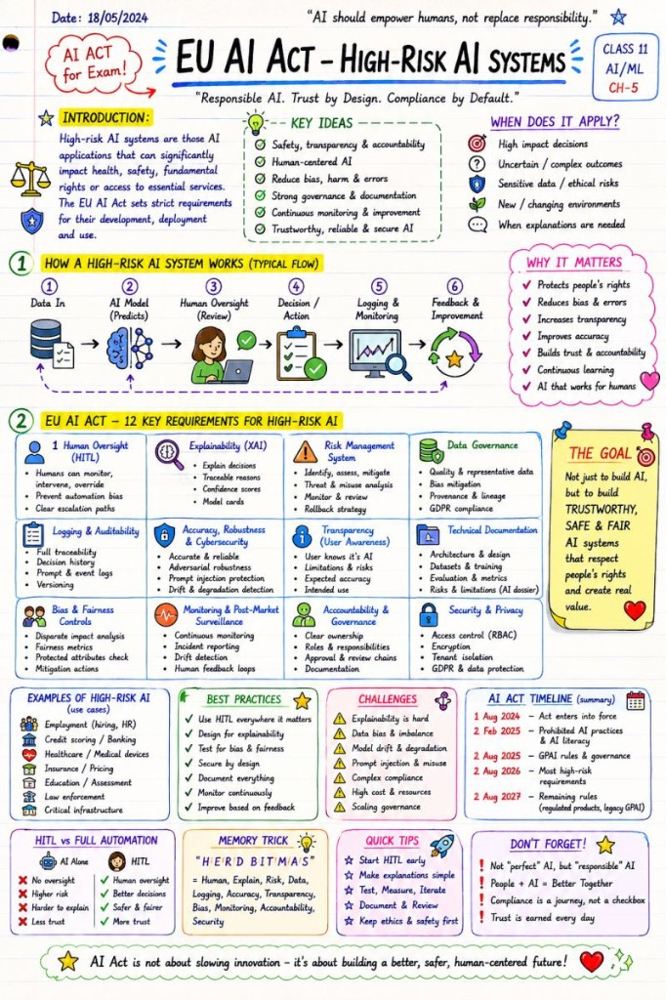

# High-Risk AI Systems

Trustworthy AI — beyond disclaimers and approval buttons.

🚨 Most people think the EU AI Act is about "adding a disclaimer" or "putting a human approval button somewhere in the UI."

It's not.

For high-risk AI systems, the discussion is moving toward something much closer to:

 ✈️ aviation safety

 🏥 medical device governance

 🏦 banking compliance

than a typical software project.

When we talk about "trustworthy AI", we are no longer speaking only about model accuracy.

We are speaking about:

Human-in-the-Loop (HITL)

Explainability (XAI)

Risk management

Bias & fairness controls

Logging & auditability

Monitoring & post-market surveillance

Governance & accountability

Cybersecurity & privacy

Transparency & documentation

And this becomes especially interesting with LLM systems because:

outputs are probabilistic

explainability is difficult

prompt injection introduces new attack surfaces

retrieval layers can inject stale or biased data

full determinism often does not exist

The result?

AI Governance is slowly becoming its own engineering discipline.

Not "just compliance".

 Not "just legal".

 Not "just AI".

But a combination of:

 AI + software engineering + security + ethics + operations + regulation.

One thing I personally find important:

 The EU AI Act is not trying to stop AI innovation.

It is trying to push us toward:

 Responsible AI

 Transparent AI

 Human-centered AI

Because in high-impact systems, "move fast and break things" is probably the worst possible strategy.

People + AI > AI alone.

## Related notes

- [EU AI Act Implementation](eu-ai-act-implementation.md)
- [Risk Management](risk-management.md)
- [Human-in-the-Loop](human-in-the-loop.md)

---

*Originally published on [LinkedIn](https://www.linkedin.com/feed/update/urn:li:activity:7465989034117545984/), 29 May 2026.*
