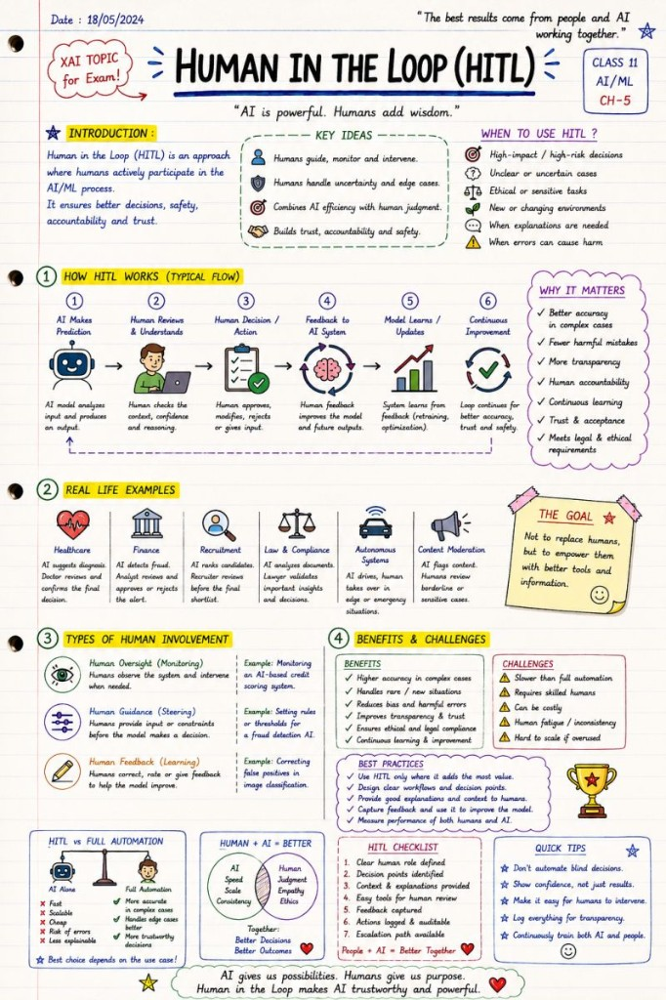

# Human-in-the-Loop

People + AI > AI alone.

🚨 Human-in-the-Loop (HITL) is not "AI failed, so a human fixes it."

It is a deliberate system design philosophy.

As AI systems become more powerful — especially in:

healthcare

finance

recruitment

cybersecurity

law enforcement

autonomous systems

…the question is no longer:

 ❓ "Can AI make decisions?"

The real question becomes:

 ❓ "When should humans remain part of the decision loop?"

That's where HITL comes in.

🎯 Human-in-the-Loop means:

 AI assists.

 Humans supervise.

 Humans intervene when judgment, ethics or accountability matter.

A good HITL system is not about slowing AI down.

It is about combining:

 ⚡ AI speed & scalability

 with

 🧠 human reasoning, context & responsibility

Typical HITL workflow:

 1️⃣ AI analyzes data

 2️⃣ AI generates prediction/recommendation

 3️⃣ Human reviews context & confidence

 4️⃣ Human approves / modifies / rejects

 5️⃣ Feedback improves the model over time

This becomes especially important in:

high-risk AI systems

uncertain edge cases

ethically sensitive decisions

situations with incomplete context

environments where errors have real-world consequences

And interestingly:

 many of the challenges in modern AI are not purely technical anymore.

They are socio-technical.

Because even the best model can fail if:

humans overtrust it

explanations are unclear

escalation paths don't exist

accountability is undefined

monitoring is weak

This is one reason why the EU AI Act emphasizes:

 ✅ Human oversight

 ✅ Transparency

 ✅ Logging & traceability

 ✅ Explainability (XAI)

 ✅ Governance & accountability

The future probably isn't:

 "AI replaces humans."

More likely:

 🤝 Humans + AI outperform either one alone.

The most successful AI systems won't be the ones with the biggest models.

They'll be the ones designed around:

 trust, oversight, safety and collaboration.

People + AI > AI alone.

## Related notes

- [High-Risk AI Systems](high-risk-ai-systems.md)
- [Risk Management](risk-management.md)
- [Monitoring & Post-Market Surveillance](monitoring-and-post-market-surveillance.md)

---

*Originally published on [LinkedIn](https://www.linkedin.com/feed/update/urn:li:activity:7466786755673747456/), 31 May 2026.*
