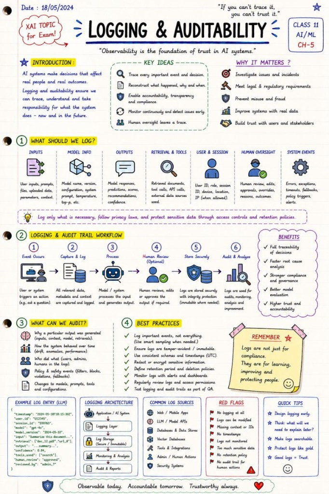

# Logging & Auditability

If you cannot inspect it, you probably should not deploy it.

🚨 In AI systems, if you cannot trace a decision…

…can you really trust it?

As AI moves into high-impact environments like:

banking

healthcare

recruitment

cybersecurity

law enforcement

one topic becomes critical:

🎯 Logging & Auditability

Because modern AI systems are not static.

They:

learn

adapt

change behavior

interact with users

consume external data

generate probabilistic outputs

And when something goes wrong, organizations need answers.

Not guesses.

Questions like:

 ❓ Why did the model make this decision?

 ❓ What data influenced the output?

 ❓ Which model version was used?

 ❓ Who approved the action?

 ❓ Was a human involved?

 ❓ Was the system behaving normally at the time?

This is where logging & auditability become essential.

A mature AI system increasingly requires:

 ✅ Decision logs

 ✅ Prompt history

 ✅ Model versioning

 ✅ Input / output traceability

 ✅ User interaction logs

 ✅ Human oversight records

 ✅ Security event logs

 ✅ Monitoring & anomaly tracking

Especially in LLM systems, this becomes even more important because:

outputs are non-deterministic

prompts change behavior

context windows evolve dynamically

retrieval systems inject external information

tool usage can trigger real-world actions

Without observability,

 AI quickly becomes a black box.

And black boxes are difficult to:

debug

secure

govern

trust

regulate

This is also why the EU AI Act strongly emphasizes:

 📌 traceability

 📌 transparency

 📌 accountability

 📌 documentation

 📌 post-market monitoring

Because "the AI decided this" is not a sufficient explanation in high-risk systems.

What's especially interesting:

 Logging in AI is no longer only about infrastructure.

It increasingly includes:

 🧠 reasoning visibility

 📄 decision context

 🔄 model lifecycle tracking

 👤 human intervention history

 ⚠️ anomaly & drift detection

In other words:

We are moving from:

 "Did the server fail?"

to:

 "Can we reconstruct the AI's reasoning and operational behavior?"

And that changes how enterprise systems are designed.

The future of trustworthy AI will likely belong to systems that are not only:

 accurate and powerful,

but also:

 observable, explainable and auditable.

Because in enterprise AI:

 If you cannot inspect it,

 you probably should not deploy it.

---

*Originally published on [LinkedIn](https://www.linkedin.com/feed/update/urn:li:activity:7467826153593131008/), 3 June 2026.*
