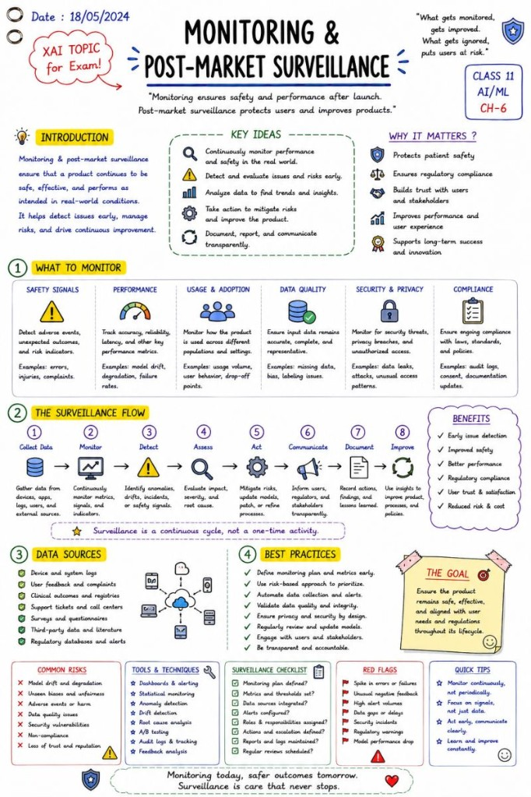

# Monitoring & Post-Market Surveillance

Launch day is not the end of the lifecycle. It's the start of operational responsibility.

🚨 One of the biggest mistakes in AI projects is believing that deployment is the finish line.

It isn't.

For high-risk AI systems, deployment is actually the beginning of a new phase:

🎯 Monitoring & Post-Market Surveillance

Because AI systems do not operate in static environments.

Over time:

user behavior changes

data changes

regulations evolve

attack patterns adapt

models drift

edge cases appear

performance degrades

Which means:

 an AI system that worked perfectly at launch may become unreliable months later.

This is exactly why the EU AI Act places strong emphasis on:

 ✅ continuous monitoring

 ✅ logging & traceability

 ✅ incident reporting

 ✅ human oversight

 ✅ post-market surveillance

 ✅ ongoing risk management

And this is especially important for:

healthcare AI

financial systems

HR & recruitment

critical infrastructure

autonomous systems

LLM-powered enterprise platforms

Monitoring is no longer just:

 📊 uptime dashboards

Modern AI monitoring increasingly includes:

 🧠 model drift detection

 ⚠️ anomaly detection

 📉 performance degradation

 🔍 hallucination tracking

 ⚖️ bias & fairness monitoring

 🔐 security & prompt injection detection

 👤 human feedback loops

 📁 auditability & traceability

One thing I find fascinating:

 AI systems are becoming closer to living systems than traditional software.

Traditional software:

mostly deterministic

stable after release

AI systems:

probabilistic

adaptive

behavior changes over time

heavily dependent on real-world data

Which means:

 continuous surveillance becomes part of the architecture itself.

And perhaps the biggest mindset shift is this:

In AI,

 success is not only:

 ❓ "Can the model perform well?"

But also:

 ❓ "Can the model remain safe, reliable and trustworthy over time?"

That changes engineering completely.

The future of enterprise AI will likely belong to organizations that know how to build systems that are not only:

 powerful,

but also:

 observable, governable and continuously improvable.

Because in AI:

 launch day is not the end of the lifecycle.

It's the start of operational responsibility.

## Related notes

- [Logging & Auditability](logging-and-auditability.md)
- [Human-in-the-Loop](human-in-the-loop.md)
- [High-Risk AI Systems](high-risk-ai-systems.md)

---

*Originally published on [LinkedIn](https://www.linkedin.com/feed/update/urn:li:activity:7469688599660294144/), 8 June 2026.*
