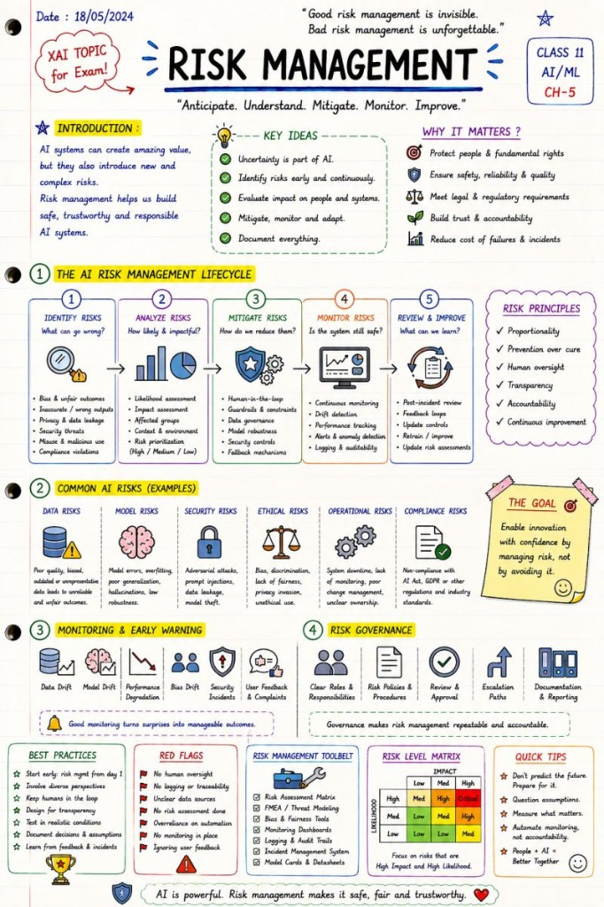

# Risk Management

Uncertainty is part of the architecture itself.

🚨 In AI, "Risk Management" is no longer optional.

Especially for high-risk AI systems.

As AI moves into:

healthcare

banking

recruitment

cybersecurity

critical infrastructure

autonomous systems

…the cost of failure becomes very real.

And unlike traditional software,

 AI systems introduce entirely new categories of risk:

hallucinations

bias

prompt injection

model drift

adversarial attacks

automation bias

unpredictable outputs

data leakage

That's why modern AI systems increasingly require:

 🎯 AI Risk Management

Not as a checkbox.

 But as a continuous lifecycle.

A mature AI risk management process usually includes:

✅ Risk Identification

 What can go wrong?

biased outputs

unsafe recommendations

security vulnerabilities

misuse scenarios

compliance issues

✅ Risk Analysis

 How likely is the risk?

 What is the impact?

 Who is affected?

✅ Risk Mitigation

 How do we reduce the probability or impact?

 Examples:

Human-in-the-Loop

fallback mechanisms

confidence thresholds

output filtering

access controls

monitoring systems

✅ Continuous Monitoring

 AI systems change over time.

 Data changes.

 Users change.

 Threats evolve.

A model that worked perfectly six months ago may become unreliable today.

This is why:

 📉 model drift detection

 📊 monitoring dashboards

 📁 logging & auditability

 🔄 retraining governance

are becoming critical parts of AI architecture.

The EU AI Act strongly reflects this mindset.

High-risk AI systems are expected to have:

documented risk management processes

ongoing monitoring

incident reporting

human oversight

governance structures

post-market surveillance

What I find especially interesting:

 AI Risk Management sits at the intersection of:

AI engineering

cybersecurity

compliance

operations

ethics

product design

This is no longer "just a data science problem."

It is becoming an enterprise-wide responsibility.

And perhaps the biggest mindset shift is this:

In traditional software,

 bugs were exceptions.

In AI systems,

 uncertainty is part of the architecture itself.

That changes everything.

The future of AI will not belong only to the companies building the most powerful models.

It will belong to the companies that know how to build:

 safe, observable, governable and trustworthy AI systems.

## Related notes

- [High-Risk AI Systems](high-risk-ai-systems.md)
- [Human-in-the-Loop](human-in-the-loop.md)
- [Logging & Auditability](logging-and-auditability.md)

---

*Originally published on [LinkedIn](https://www.linkedin.com/feed/update/urn:li:activity:7467079495624155136/), 1 June 2026.*
