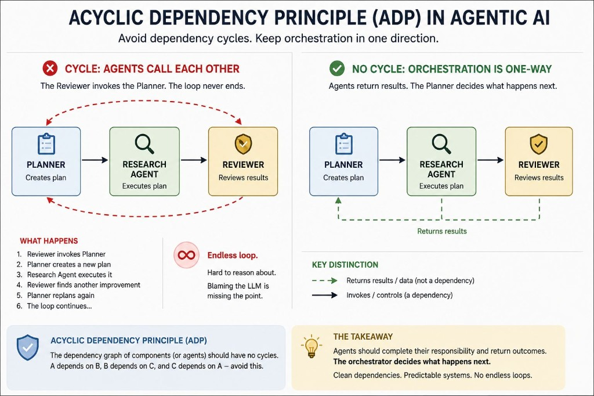

# Acyclic Dependency Principle

Avoid dependency cycles. Keep orchestration in one direction.

One of the easiest ways to build an agent that never finishes its task is to create a dependency cycle.

This is exactly what the Acyclic Dependency Principle (ADP) has been warning us about for decades.

While building multi-agent systems on Google's Agent Development Kit, I found myself looking for a way to prevent exactly this kind of situation. It reminded me of a principle that has been part of software architecture for years.

In classical software architecture, ADP states that component dependencies should never form cycles. Once Component A depends on B, B depends on C, and C depends back on A, the architecture becomes harder to understand, test, and evolve.

The same architectural concern exists in agent systems.

Consider a simple workflow:

Planner → Research Agent → Reviewer

Everything is predictable until the Reviewer decides to invoke the Planner directly.

Now the Planner creates a new plan.

The Research Agent executes it.

The Reviewer finds another improvement.

The Planner replans again.

The loop continues.

Many people would blame the LLM for "thinking forever."

I'd argue that, in many cases, the architecture deserves the blame instead.

One distinction became important while building these workflows:

Returning a result is not the same as introducing a dependency.

An agent shouldn't decide what happens next. It should complete its responsibility and return the outcome.

The orchestrator remains responsible for deciding the next step.

That simple separation keeps dependencies clean while still allowing iterative workflows.

As we design increasingly sophisticated multi-agent systems, I keep finding that many of the solutions already exist in software architecture. We're not replacing architectural principles—we're applying them to a different execution model.

---

*Originally published on [LinkedIn](https://www.linkedin.com/feed/update/urn:li:activity:7478300532642570240/), 2 July 2026.*
