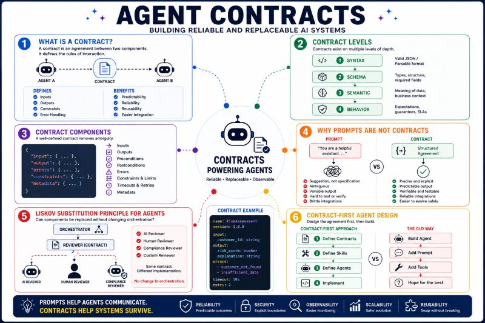

# Agent Contracts

From prompt-first to contract-first design.

Over the past few weeks, I've been exploring agent architectures, skills, orchestration, and multi-agent systems.

One observation keeps resurfacing:

Many agent systems are being built around prompts, while mature software systems are built around contracts.

In traditional software engineering, a contract defines:

✔ What a component expects

✔ What it provides

✔ How failures are handled

This principle has helped us build maintainable APIs, services, and distributed systems for decades.

Yet in many agent implementations, interactions often look like this:

"You are a helpful agent..."

followed by the hope that the output will match what the next component expects.

The challenge is that prompts are not contracts.

A contract specifies:

- Inputs
- Outputs
- Constraints
- Error conditions
- Expected behaviour

Without this, every integration becomes fragile.

This becomes especially important when agents collaborate with:

- Other agents
- Skills
- Tools
- External APIs
- Human reviewers

A skill that returns:

```json
{
 "answer": "..."
}
```

today and

```json
{
 "result": "..."
}
```

tomorrow may seem like a small change.

For an orchestrator, it's a broken workflow.

This is where classic software engineering principles such as the Liskov Substitution Principle become surprisingly relevant in Agentic AI.

The question is no longer:

"Can Agent B inherit from Agent A?"

The question becomes:

"Can I replace one agent, skill, model, tool, or human reviewer with another without changing the orchestration logic?"

That is contract-driven design.

As agent ecosystems grow, I suspect we'll see a shift from:

Prompt-First Design

to

Contract-First Design

where skills become well-defined capabilities with explicit interfaces, preconditions, postconditions, reliability metrics, and behavioural guarantees.

Perhaps the next evolution of Agent Engineering won't come from better prompts.

It may come from rediscovering some of the software architecture principles we've known all along.



## Related notes

- [Interface Segregation Principle](interface-segregation-principle.md)
- [Agent-to-Agent Protocol](../agents/agent-to-agent-protocol.md)
- [Agent Communication Patterns](../agents/agent-communication-patterns.md)

---

*Originally published on [LinkedIn](https://www.linkedin.com/feed/update/urn:li:activity:7475060300271112192/), 23 June 2026.*
