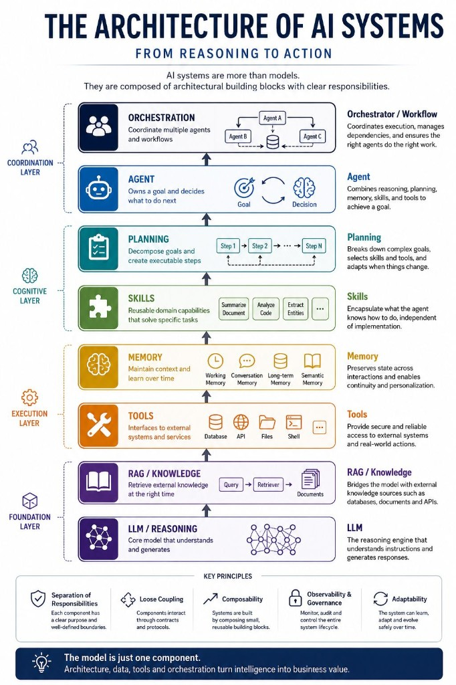

# The Architecture of AI Systems

From reasoning to action — and why responsibility separation matters more than the model.

I took long vacation for the last two weeks but now the time has come to continue my personal journey in the world of architecture and agents. I came across this infographic recently, and I think it does a good job of explaining AI systems to a broad audience.

As architects, however, I think the picture is still incomplete.

The interesting part is not what each component is. The interesting part is how the responsibilities are separated.

An LLM is responsible for reasoning.

RAG is responsible for retrieving external knowledge.

Memory is responsible for preserving state across interactions.

Skills encapsulate domain capabilities. They describe what an agent can do without exposing how it is implemented.

Tools provide integration with external systems such as databases, APIs, browsers, file systems, or enterprise applications.

Planning decomposes a goal into executable steps and continuously re-evaluates the next action.

An Agent owns a goal. It combines reasoning, planning, memory, skills, and tools to achieve that goal.

When multiple agents collaborate, orchestration becomes another architectural concern. Someone has to coordinate execution, resolve dependencies, and manage communication.

Finally, protocols such as MCP standardize how models discover and consume external capabilities. They solve an integration problem, not an intelligence problem.

What I find fascinating is that most discussions still focus on choosing the "best LLM."

From an architectural perspective, the model is only one component.

The quality of an AI system is far more influenced by how responsibilities are partitioned, how components communicate, and how execution is orchestrated than by replacing one foundation model with another.

As with every distributed system, architecture eventually becomes more important than the individual components.

## P.S.

Yes, I polish my posts with LLMs. Besides that the ideas, the infographics and anything else is a result of personal research. That's how I see good quality LLM collaboration. And yes, it's a learning journey since one of my KPIs is to start taking architectural decisions but no learning path is provided. So I decided to create my own. Creating a learning experience is one of my super powers and now I apply this to me.

## P.S. after the P.S.

Any suggestion for further books on architecture (after Uncle Bob) will be highly appreciated!

## Related notes

- [Core Design Principles](../agents/core-design-principles.md)
- [Fallback Architecture](../agents/fallback-architecture.md)
- [Single Responsibility Principle](single-responsibility-principle.md)

---

*Originally published on [LinkedIn](https://www.linkedin.com/feed/update/urn:li:activity:7484852113391542273/), 20 July 2026.*
