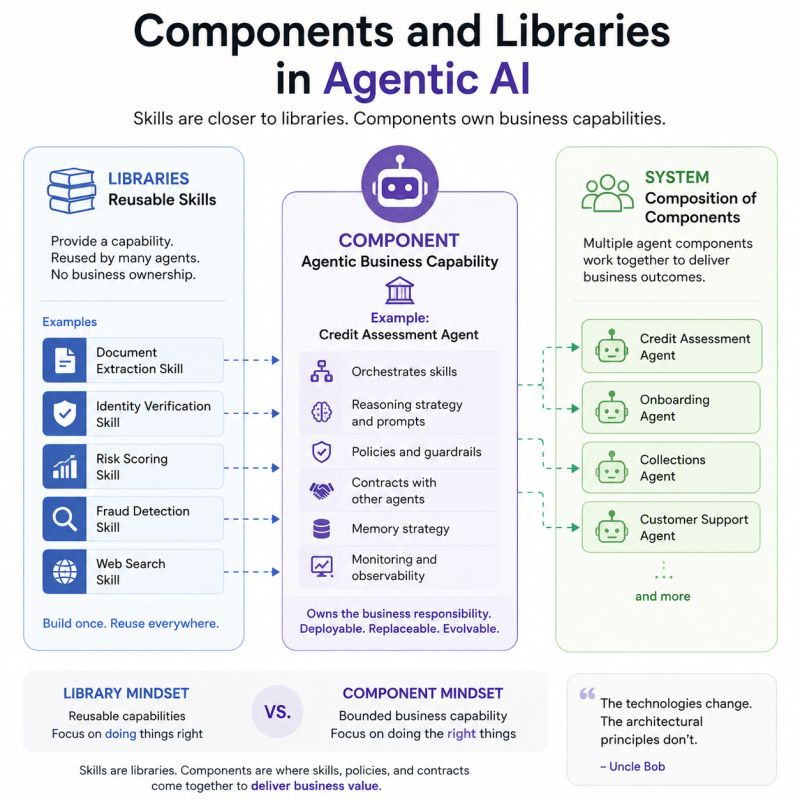

# Components and Skills

Skills are closer to libraries. Components own business capabilities.

I started reading the chapter on Components in Clean Architecture by Uncle Bob.

It made me wonder how these ideas translate to Agentic AI.

One comparison that immediately came to mind was the relationship between components and skills.

At first glance, it seems natural to say:

"A skill is a component."

But the more I thought about it, the more I believe that's not quite right.

A reusable skill—whether it's document extraction, risk scoring, or customer verification—looks much more like a library than a component.

It provides a capability.

It doesn't own a business responsibility.

A component, on the other hand, feels more like a bounded business capability.

For example, imagine a Credit Assessment Agent.

It may combine multiple reusable skills:

Income Verification

Credit History Analysis

Risk Scoring

Fraud Detection

These skills can be reused by many different agents.

The component is the place where they are assembled into a coherent business capability, together with:

- prompts and reasoning strategy
- policies and guardrails
- contracts with other agents
- memory strategy
- monitoring and observability

The component can evolve independently.

The skills remain reusable building blocks.

This distinction becomes even more important as organizations move from a handful of agents to hundreds of them.

Without clear component boundaries, every new agent starts copying prompts, policies, and orchestration logic.

Eventually, you're no longer building an agent platform.

You're maintaining a collection of intelligent scripts.

One thing I continue to appreciate while reading Clean Architecture is how many of these architectural ideas remain relevant.

The technologies change.

The architectural principles don't.

Perhaps the next challenge for software architects isn't inventing entirely new patterns for Agentic AI—but recognizing which proven principles simply need a new vocabulary.

What do you think?

Would you consider a skill to be closer to a library, while the component represents the business capability that composes those skills?

---

*Originally published on [LinkedIn](https://www.linkedin.com/feed/update/urn:li:activity:7476146753189203968/), 26 June 2026.*
