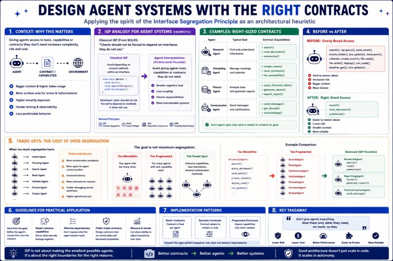

# Interface Segregation Principle

Design agent systems with the right contracts — not too monolithic, not too fragmented.

I'm continuing my journey through Clean Architecture by Uncle Bob.

The next principle discussed in the book is the Interface Segregation Principle (ISP), and it got me thinking about agent design.

Before anyone reaches for the comments section 😊, I'm not claiming that ISP maps directly to Agentic AI.

The closer concepts are probably Principle of Least Privilege, Capability-Based Design, and Separation of Concerns.

What caught my attention was the architectural intuition behind ISP:

> Avoid forcing components to depend on things they don't need.

When designing agents, a similar question emerges:

> How many capabilities should an agent really have?

Many agent implementations start with a "give it everything" approach:

- Web Search
- SQL
- Email
- Calendar
- File Access
- Python Execution
- Jira
- Slack
- CRM
- ...

The result is a very capable agent.

But also a more complex one.

Larger context windows.

More opportunities for mistakes.

More security exposure.

Harder testing and observability.

The obvious reaction is to split everything into smaller agents.

But that comes with its own trade-offs.

Research Agent → Validation Agent → Formatting Agent → Security Agent → Reporting Agent → Delivery Agent

At some point, the orchestration layer becomes the new monolith.

More coordination.

More latency.

More contracts.

More debugging.

So perhaps the real question is not:

> How small should agents be?

but rather:

> What is the smallest useful boundary?

Not too monolithic.

Not too fragmented.

Just enough responsibility to remain cohesive while avoiding unnecessary dependencies.

For me, that's the most interesting takeaway from this chapter.

Not the principle itself.

The architectural thinking behind it.

## Related notes

- [Single Responsibility Principle](single-responsibility-principle.md)
- [Agent Contracts](agent-contracts.md)

---

*Originally published on [LinkedIn](https://www.linkedin.com/feed/update/urn:li:activity:7475423087979753472/), 24 June 2026.*
