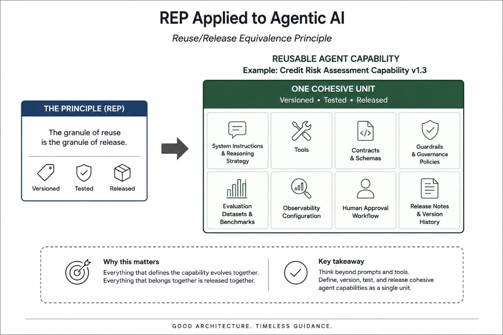

# Reuse/Release Equivalence Principle

Version cohesive agent capabilities — not just prompts and tools.

One of the oldest promises in object-oriented software development is reusability.

The Reuse/Release Equivalence Principle (REP) tells us that reusable components should be tracked, versioned, and released together because we need to know what changed, when it changed, and what a new release contains.

A reusable component isn't just a random collection of classes or modules. It represents a cohesive unit that is versioned, tested, released, and evolves together.

Can we apply the same principle to Agentic AI?

Instead of asking, "Which prompts or tools can I reuse?", maybe we should be asking, "What business capability should be reusable?"

Those are two very different questions.

Imagine releasing a Credit Risk Assessment Capability v1.3 instead of a collection of disconnected assets.

That capability would contain everything required for that business function:

- System instructions and reasoning strategy
- Available tools
- Contracts and schemas
- Guardrails and governance policies
- Evaluation datasets and benchmarks
- Observability configuration
- Human approval workflow
- Release notes and version history

Everything evolves together because everything belongs together.

REP encourages us to think beyond reusable prompts and tools, and instead define cohesive agent capabilities that can be versioned, tested, and released as a single unit.

## Related notes

- [Components and Skills](components-and-skills.md)
- [Acyclic Dependency Principle](acyclic-dependency-principle.md)

---

*Originally published on [LinkedIn](https://www.linkedin.com/feed/update/urn:li:activity:7477957285588361217/), 1 July 2026.*
