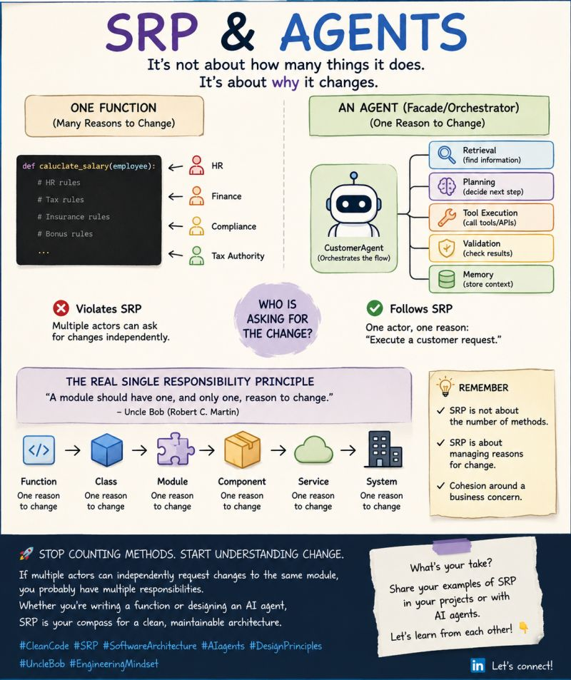

# Single Responsibility Principle

It's not about how many things an agent does. It's about why it changes.

Over the weekend, I spent some time reading Clean Architecture by Robert C. Martin.

While reading, I had an interesting realization.

Many of the challenges we face when building AI agents are not new at all.

We are applying the same engineering principles that have guided software architecture for decades — just in a new environment.

Take the famous Single Responsibility Principle (SRP).

SRP is often simplified as:

"One class should do one thing."

Or:

"One method should do one thing."

Those are useful rules of thumb. They help us write cleaner and more maintainable code.

But the original principle goes deeper:

> "A module should have one, and only one, reason to change."

And that's where things become interesting for agentic systems.

Consider an agent that:

- retrieves information
- plans actions
- calls tools
- validates outputs
- stores memory

At first glance, it looks like it has multiple responsibilities.

But does it?

Not necessarily.

The real question is:

Who is asking for the change

If all of these capabilities exist to support a single business concern — for example, executing a customer request — then the agent may still have a single responsibility.

Now compare that to a single function that contains HR rules, tax rules, compliance rules, and reporting logic.

One function.

Multiple reasons to change.

Potentially multiple responsibilities.

The number of methods is not the point.

The number of classes is not the point.

The number of tools an agent can call is not the point.

SRP is about reasons for change, not about counting methods.

Reading Clean Architecture reminded me that many of the problems we discuss in AI today are actually architecture problems we have been solving for years.

The environment is new.

The principles are not.

## Related notes

- [Interface Segregation Principle](interface-segregation-principle.md)
- [Designing an Agent](../agents/designing-an-agent.md)

---

*Originally published on [LinkedIn](https://www.linkedin.com/feed/update/urn:li:activity:7474695410708668416/), 22 June 2026.*
