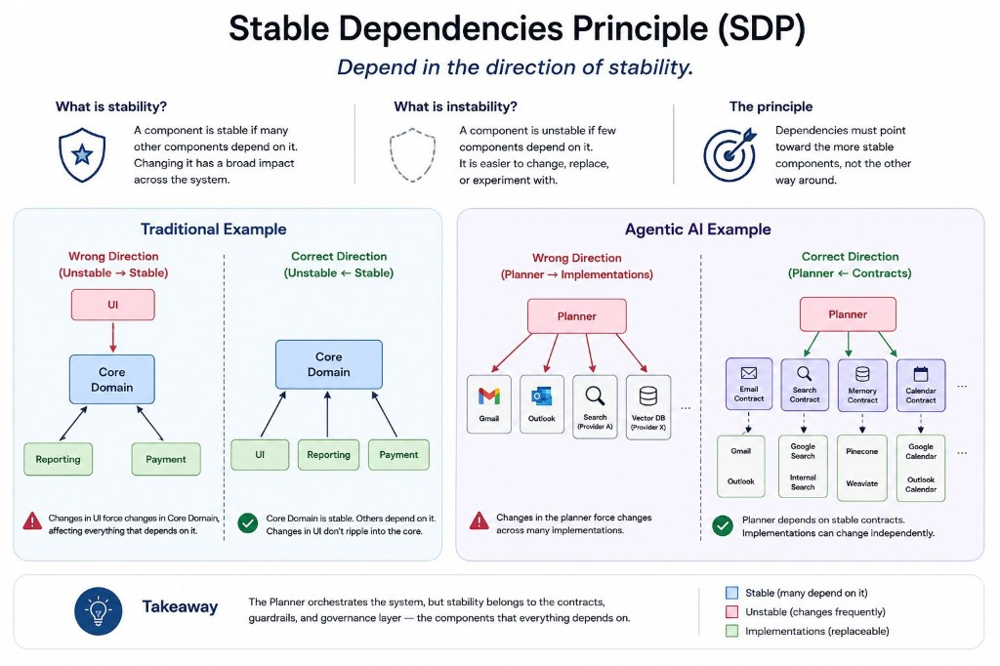

# Stable Dependencies Principle

Depend in the direction of stability — and why the Planner is not the architectural center.

I have reached a principle in Clean Architecture that I don't recall reading about before: the Stable Dependencies Principle (SDP).

At first, I interpreted stable as a component that rarely changes.

That isn't what the principle is about.

A stable component is one that many other components depend on. Because changing it would have a huge impact across the system, it becomes more resistant to change.

An unstable component is the opposite. Few things depend on it, making it easier to modify, replace, or experiment with.

The Stable Dependencies Principle tells us that dependencies should always point toward the more stable components.

Otherwise, every change in a volatile part of the system ripples into components that should remain stable, gradually making the architecture harder to evolve.

Looking at agent architectures through this lens, my first thought was to mark the Planner as the stable component. After all, it sits at the center of the execution flow.

The Planner is usually one of the most volatile parts of the system. We continuously experiment with prompting strategies, planning algorithms, reflection, memory, reasoning techniques, and orchestration patterns. It is often the first component to evolve as our understanding of the problem matures.

So if the Planner isn't the stable component, what is?

I thinking about the contracts here.

An EmailContract shouldn't change because the implementation moves from Gmail to Outlook.

A SearchContract shouldn't change because today's search provider is replaced tomorrow.

The same reasoning applies to guardrails and governance. They define architectural rules that every planner and every agent should depend on, regardless of how the underlying implementations evolve.

The Planner may orchestrate the execution of the system, but that doesn't make it the architectural center.

The architectural center should be formed by the components that everything else depends on and that we cannot afford to change lightly.

Perhaps, in Agentic AI, those are the contracts, the guardrails, and the governance layer—not the Planner itself.

## Related notes

- [Acyclic Dependency Principle](acyclic-dependency-principle.md)
- [Dependency Inversion Principle](../agents/dependency-inversion-principle.md)

---

*Originally published on [LinkedIn](https://www.linkedin.com/feed/update/urn:li:activity:7478679707731894272/), 3 July 2026.*
