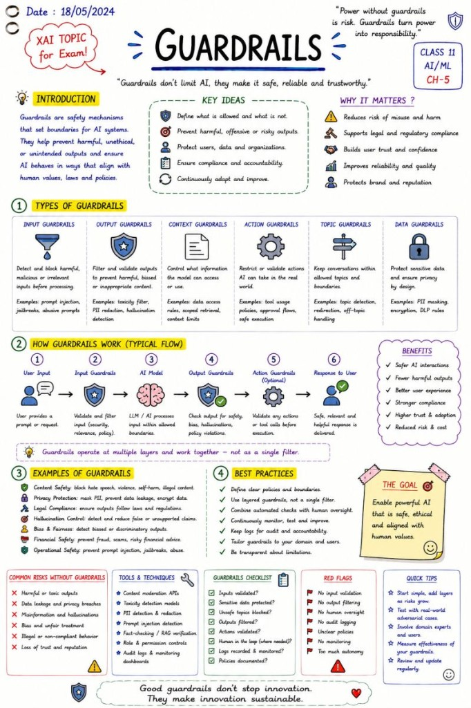

# AI Guardrails

Good guardrails do not kill innovation — they make innovation sustainable.

🚨 The more powerful AI becomes, the more important Guardrails become.

Because without boundaries,

 even highly capable AI systems can produce:

harmful outputs

unsafe actions

policy violations

hallucinations

data leaks

prompt injection vulnerabilities

That's where:

 🎯 AI Guardrails

 come in.

Guardrails are the safety mechanisms that help AI systems stay:

 ✅ safe

 ✅ reliable

 ✅ compliant

 ✅ aligned with human intent

And contrary to popular belief:

 Guardrails are not about "restricting AI."

They are about making AI deployable in the real world.

Especially in enterprise environments where AI interacts with:

customers

employees

confidential data

financial systems

healthcare information

production infrastructure

Modern AI systems increasingly need multiple layers of guardrails:

🛡️ Input Guardrails

 Validate and filter prompts before processing.

 Examples:

jailbreak detection

prompt injection filtering

malicious input detection

🛡️ Output Guardrails

 Inspect responses before they reach users.

 Examples:

toxicity filtering

hallucination checks

PII redaction

policy validation

🛡️ Action Guardrails

 Control what the AI is allowed to do.

 Examples:

restricted tool access

approval workflows

safe API execution

human approval before critical actions

🛡️ Context Guardrails

 Limit what information the model can access or use.

 Examples:

scoped retrieval

permission-aware RAG

tenant isolation

🛡️ Governance Guardrails

 Ensure accountability, monitoring and compliance.

 Examples:

logging & auditability

human oversight

monitoring dashboards

policy enforcement

And this becomes especially important with LLM systems because:

 natural language itself has become an attack surface.

A modern AI system is no longer "just a model."

It is an ecosystem of:

prompts

retrieval layers

tools

APIs

agents

memory

users

automation

Which means:

 AI safety is increasingly becoming a systems engineering problem.

This is also why the EU AI Act places strong emphasis on:

 📌 risk management

 📌 human oversight

 📌 transparency

 📌 monitoring

 📌 accountability

 📌 security controls

Because powerful AI without guardrails is not innovation.

It is unmanaged risk.

The future will likely belong to AI systems that are not only:

 smart,

but also:

 safe, observable, controllable and trustworthy.

Good guardrails do not kill innovation.

They make innovation sustainable.

## Related notes

- [Prompt Injection](prompt-injection.md)
- [Safety Enforcement](safety-enforcement.md)
- [Relevance Control](relevance-control.md)

---

*Originally published on [LinkedIn](https://www.linkedin.com/feed/update/urn:li:activity:7468195116902428673/), 4 June 2026.*
