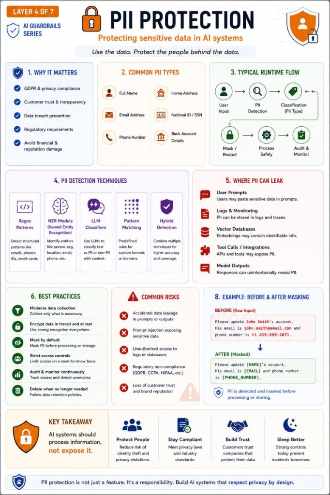

# PII Protection

Use the data. Protect the people behind the data.

🔒 One leaked customer record is all it takes.

As AI systems become more deeply integrated into business processes, protecting Personally Identifiable Information (PII) is no longer optional.

It's a core architectural requirement.

Examples of PII include:

- Names
- Email addresses
- Phone numbers
- National IDs
- Bank account details
- Customer records

A typical PII Protection layer performs:

🔍 Detection  
Identify sensitive information in prompts, documents, and model responses.

✂️ Masking & Redaction  
Remove or hide sensitive values before processing.

📜 Policy Enforcement  
Apply organization-specific privacy rules.

📝 Audit Logging  
Track access to sensitive data.

🚨 Escalation  
Trigger additional review for high-risk cases.

A common flow looks like:

Input  
→ PII Detection  
→ Classification  
→ Mask / Redact  
→ Process Safely  
→ Audit & Monitor

The challenge is that modern AI systems process enormous amounts of unstructured data.

A single prompt can contain:

- customer information
- HR records
- financial data
- healthcare data

Without proper controls, sensitive information can easily appear in:

- prompts
- vector databases
- logs
- model outputs

The goal is simple:

Use the data.

Protect the people behind the data.

## Related notes

- [Secure RAG](secure-rag.md)
- [AI Guardrails](ai-guardrails.md)

---

*Originally published on [LinkedIn](https://www.linkedin.com/feed/update/urn:li:activity:7472166330960633856/), 15 June 2026.*
