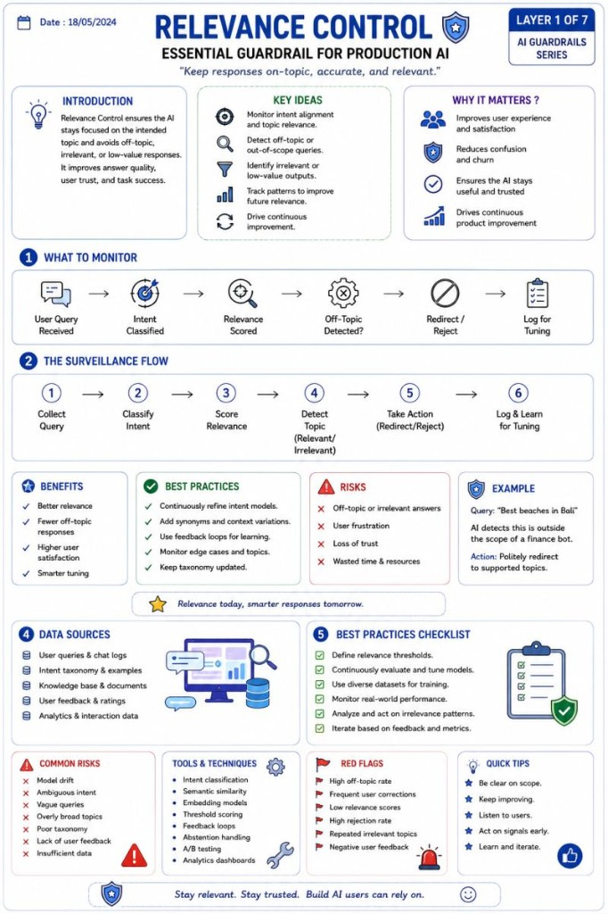

# Relevance Control

From User → LLM → Response to AI runtime engineering.

🚨 One of the biggest misconceptions in AI right now:

People still think production AI systems are:

User → LLM → Response

In reality, enterprise AI is becoming an entire runtime architecture.

A real production flow looks more like:

User  
 → input validation  
 → intent classification  
 → policy checks  
 → retrieval/context filtering  
 → LLM  
 → output validation  
 → tool permission checks  
 → monitoring & audit logging

Example: Relevance Control

Typical implementation includes:

- intent classification
- domain/scope validation
- embedding similarity checks
- confidence scoring
- fallback routing
- logging false positives/negatives

And this is the important part:

Guardrails should not exist only AFTER the model responds.

They should exist:

- before model execution
- around tool execution
- after response generation
- during runtime monitoring

The industry is slowly moving away from "prompt engineering" and toward something much bigger:

AI Runtime Engineering.

That's where reliability, governance, security, observability, routing, memory, and orchestration start becoming more important than the model itself.

Honestly, a lot of modern AI engineering now feels closer to distributed systems + security engineering than classic ML.

---

*Originally published on [LinkedIn](https://www.linkedin.com/feed/update/urn:li:activity:7469985670288109570/), 9 June 2026.*
