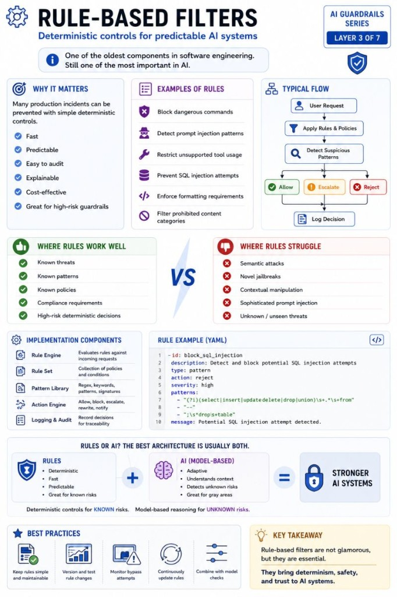

# Rule-Based Filters

Deterministic controls for predictable AI systems.

⚙️ Rule-Based Filters are one of the oldest components in software engineering.

And surprisingly, they still matter in AI systems.

With all the attention on LLMs, embeddings, and agents, it's easy to forget that many production incidents can be prevented with simple deterministic controls.

Examples:

- Block dangerous commands
- Detect prompt injection patterns
- Restrict unsupported tool usage
- Prevent SQL injection attempts
- Enforce formatting requirements
- Filter prohibited content categories

A typical implementation looks like this:

User Request  
 → Apply Rules & Policies  
 → Detect Suspicious Patterns  
 → Allow / Reject / Escalate  
 → Log Decision

The key advantage?

Predictability.

Unlike LLM-based classifiers, rule engines produce the same result every time for the same input.

That's extremely valuable for:

- compliance requirements
- security controls
- auditability
- high-risk workflows

That said, rule-based filters are not a silver bullet.

They work well against:

✅ known threats  
✅ known patterns  
✅ known policies

But they struggle with:

❌ semantic attacks  
❌ novel jailbreaks  
❌ contextual manipulation  
❌ sophisticated prompt injection

The most effective architecture is rarely:

Rules OR AI

It's usually:

Rules + AI

Deterministic controls for known risks.

Model-based reasoning for unknown risks.

Production AI systems need both.

## Related notes

- [Tool Access Control](tool-access-control.md)
- [Safety Enforcement](safety-enforcement.md)
- [AI Guardrails](ai-guardrails.md)

---

*Originally published on [LinkedIn](https://www.linkedin.com/feed/update/urn:li:activity:7471506238711910400/), 13 June 2026.*
