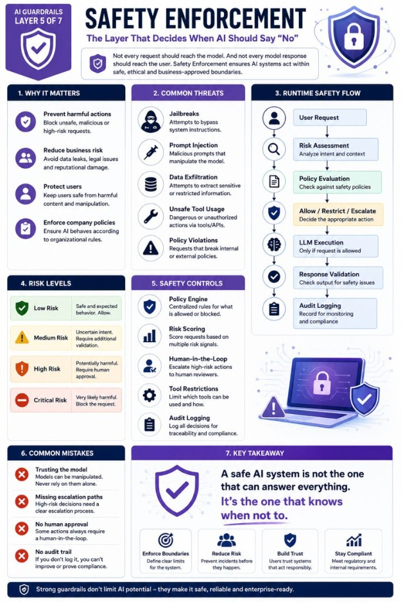

# Safety Enforcement

🛡️ Safety Enforcement: The Layer That Decides When AI Should Say "No"

Not every request should reach the model.

And not every model response should reach the user.

That's where Safety Enforcement comes in.

Most AI incidents are not caused by bad models.

They happen because systems lack clear enforcement mechanisms.

Examples:

- Harmful instructions
- Unsafe tool execution
- Data exfiltration attempts
- Prompt injection attacks
- Jailbreak attempts
- Policy violations

A typical safety flow looks like:

User Request  
 → Risk Assessment  
 → Policy Evaluation  
 → Allow / Restrict / Escalate  
 → LLM Execution  
 → Response Validation  
 → Audit Logging

One important distinction:

Safety Enforcement is not the same as Content Moderation.

Content Moderation asks:

"Is this content allowed?"

Safety Enforcement asks:

"Is this action safe?"

This becomes especially important when AI systems can:

- execute tools
- access databases
- send emails
- modify records
- trigger workflows

At that point, the question is no longer:

"Can the model answer?"

The question becomes:

"Should the system perform the action?"

Strong AI systems don't just generate responses.

They enforce boundaries.

Because sometimes the safest answer is:

"No."

---

*Originally published on [LinkedIn](https://www.linkedin.com/feed/update/urn:li:activity:7472868705211772928/), 17 June 2026.*
