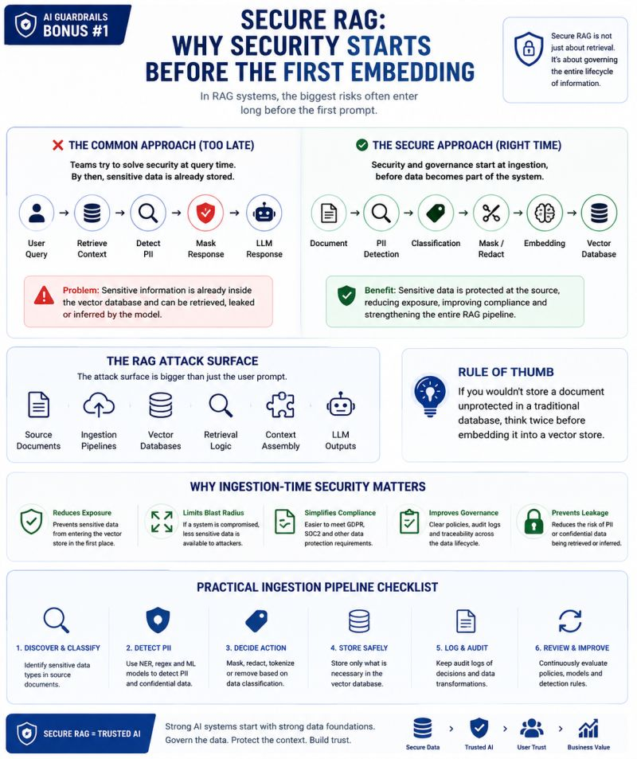

# Secure RAG

Why security starts before the first embedding.

AI Guardrails Bonus #1  
SECURE RAG & RETRIEVAL GOVERNANCE

🔒 Secure RAG: Why Security Starts Before the First Embedding

Many teams focus on securing prompts.

Far fewer focus on securing the ingestion pipeline.

And that's often where the real problem starts.

A typical RAG architecture looks like this:

📄 Documents  
 → ✂️ Chunking  
 → 🧠 Embedding  
 → 🗄️ Vector Database  
 → 🔍 Retrieval  
 → 🤖 LLM

Now imagine those documents contain:

- Customer names
- Email addresses
- Phone numbers
- Financial records
- HR information
- Internal company data

A common mistake is trying to solve security only at query time:

👤 User Query  
 → Retrieve Context  
 → Detect PII  
 → Mask Response

But by then, the sensitive information is already stored inside the vector database.

The reality is:

🚨 Security starts before the first embedding.

A more secure architecture looks like:

📄 Document  
 → 🔍 PII Detection  
 → 🏷️ Classification  
 → ✂️ Mask / Redact  
 → 🧠 Embedding  
 → 🗄️ Vector Database

Why does this matter?

✅ Reduces sensitive data exposure

✅ Limits the blast radius of a security incident

✅ Simplifies GDPR and compliance requirements

✅ Improves governance and auditability

✅ Prevents accidental leakage through retrieval

Another challenge many teams overlook:

Even if prompts are clean, retrieved context may not be.

The attack surface is no longer only the user prompt.

It includes:

- Source documents
- Ingestion pipelines
- Vector databases
- Retrieval logic
- Context assembly

A useful rule of thumb:

💡 If you wouldn't store a document unprotected in a traditional database, think twice before embedding it into a vector store.

Secure RAG is not just about retrieval.

It's about governing the entire lifecycle of information.

## Related notes

- [Prompt Injection](prompt-injection.md)
- [Relevance Control](relevance-control.md)
- [PII Protection](pii-protection.md)

---

*Originally published on [LinkedIn](https://www.linkedin.com/feed/update/urn:li:activity:7472508636586737664/), 16 June 2026.*
