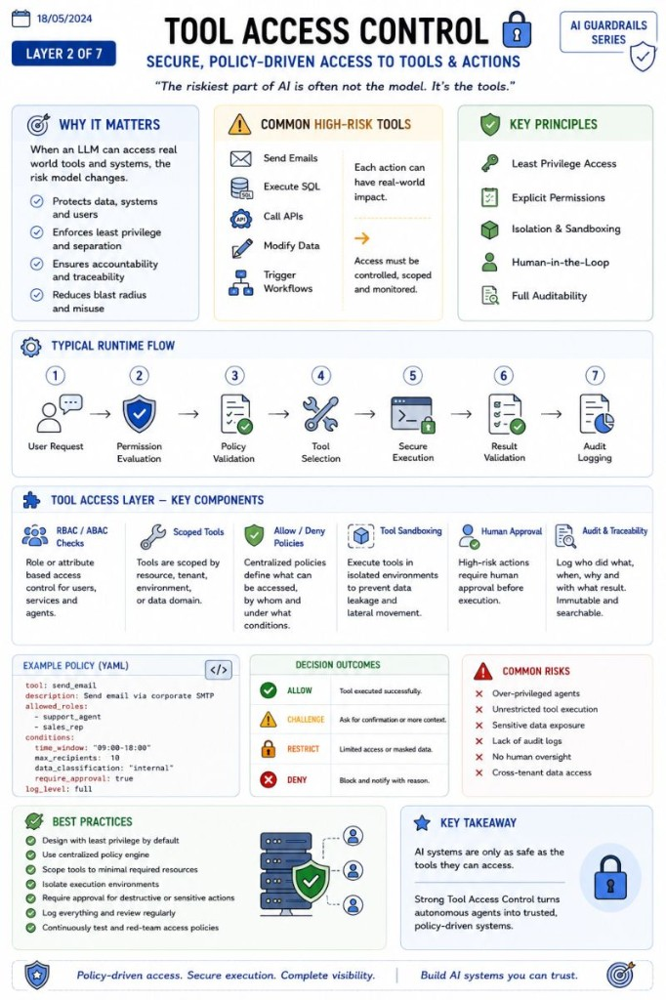

# Tool Access Control

Secure, policy-driven access to tools and actions.

🔐 Tool Access Control is where AI systems stop being "chatbots" and start becoming infrastructure.

The moment an LLM can:

- send emails
- execute SQL
- call APIs
- modify data
- trigger workflows

…the entire risk model changes.

At that point, the problem is no longer just "AI accuracy."

It becomes:

- permissions
- identity
- auditability
- isolation
- rollback
- approval flows

A proper Tool Access layer usually includes:

- RBAC / ABAC permission checks
- scoped tool execution
- allow/deny policies
- tool sandboxing
- human approval for high-risk actions
- execution logging and traceability

Typical runtime flow:

User request  
 → permission evaluation  
 → policy validation  
 → tool selection  
 → secure execution  
 → result validation  
 → audit logging

One thing many teams still underestimate:

The dangerous part of AI is often not the model.

It's the tools connected to the model.

This is why modern AI architecture is increasingly converging with:

- Zero Trust security
- Platform engineering
- Identity & Access Management
- Runtime governance

The future of enterprise AI will not be "unlimited autonomous agents."

It will be policy-driven agents operating inside controlled execution environments.

---

*Originally published on [LinkedIn](https://www.linkedin.com/feed/update/urn:li:activity:7471047603032383488/), 12 June 2026.*
