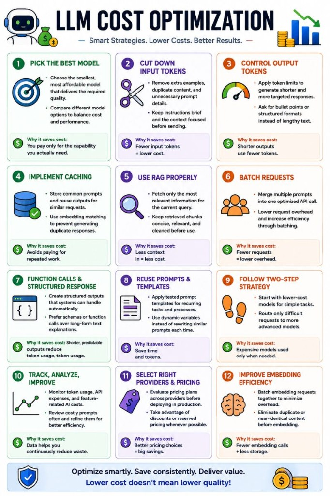

# LLM Cost Optimization

Sustainable AI — not cheap AI.

🚨 One of the biggest misconceptions in GenAI today is:

"If the AI works technically, the problem is solved."

Not really.

Because once AI reaches production, a completely different problem appears:

💸 Cost predictability.

And unlike traditional software systems, LLM costs are not fixed.

They depend on:

prompt size

context growth

retries

reasoning depth

tool calls

RAG retrieval

embeddings

user behavior

agent loops

Meaning:

 two users using the exact same feature can generate radically different costs.

This is why many AI demos look amazing…

 until real-world usage starts.

One thing I've been thinking about recently:

Prompt engineering is slowly becoming:

 📊 financial engineering.

Because every:

extra token

unnecessary chunk

retry loop

oversized context

agent step

has direct economic impact.

This is also why cost optimization is becoming a serious engineering discipline.

Not "cheap AI".

But:

 🎯 sustainable AI.

Some of the most important optimization strategies today:

 ✅ Model routing

 ✅ Context compression

 ✅ Smart RAG

 ✅ Caching

 ✅ Structured outputs

 ✅ Token limits

 ✅ Batch requests

 ✅ Embedding optimization

 ✅ Cost observability

 ✅ Per-user quotas

And perhaps the most important realization:

The question is no longer only:

 ❓ "Can we build it?"

But increasingly:

 ❓ "Can we scale it economically?"

Because in production:

 unbounded AI systems can quietly become:

 🔥 token bonfires.

I suspect that in the next few years we'll see the rise of:

 📈 LLM FinOps

Just like:

Cloud FinOps

MLOps

SecOps

Because companies deploying AI at scale will eventually need:

 AI + infrastructure + governance + economics

all working together.

The future winners in AI may not be the companies with the largest models.

But the ones that know how to:

 build powerful systems

 while keeping them observable, controllable and economically sustainable.

## Related notes

- [Cost Predictability](llm-cost-predictability.md)

---

*Originally published on [LinkedIn](https://www.linkedin.com/feed/update/urn:li:activity:7469249901793599488/), 7 June 2026.*
