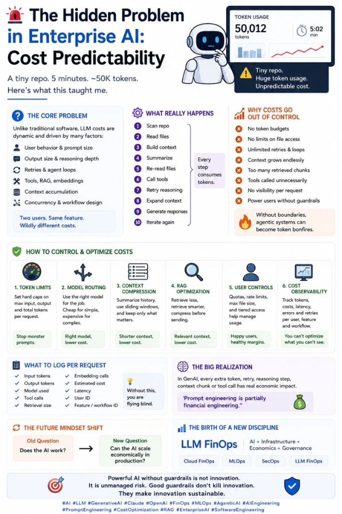

# Cost Predictability

The hidden problem in enterprise AI.

🚨 I think many people still underestimate one of the biggest challenges in enterprise AI:

💸 Cost predictability.

Not model quality.

 Not benchmarks.

 Not "which LLM is best."

But:

 ❓ "Can we actually control and predict AI costs once real users arrive?"

I recently tested an agentic coding workflow on a tiny repository.

Very small codebase.

The result?

⚠️ ~50K tokens consumed in about 5 minutes.

For a repo that a human could inspect very quickly.

And this perfectly demonstrates something important:

The problem is often not the repo size.

The problem is:

 🧠 agent behavior.

Because modern AI workflows are no longer:

Prompt → Response

They are more like:

Repo scan

 → Read files

 → Build context

 → Summarize

 → Re-read files

 → Call tools

 → Retry reasoning

 → Expand context

 → Generate explanations

 → Iterate again

Every step consumes tokens.

And the dangerous part is:

 many of these systems are effectively open-ended.

Meaning:

users don't know the cost

companies don't know the cost

agents don't optimize for the cost

This creates a very strange new engineering problem:

⚡ The AI works technically…

 💸 but the economics may not scale.

What I increasingly believe:

 prompt engineering is partially becoming

 📊 financial engineering.

Because every:

extra context window

retry

tool call

reasoning loop

retrieval chunk

agent step

has a real economic impact.

This is why I think mature AI systems will increasingly require:

 ✅ token budgets

 ✅ runtime limits

 ✅ tool-call limits

 ✅ context compression

 ✅ model routing

 ✅ cost observability dashboards

 ✅ per-user quotas

 ✅ approval workflows for "deep" analysis

Without boundaries,

 agentic systems can quietly become:

 🔥 token bonfires.

And this is where the industry mindset is slowly changing.

The future question may no longer be:

 ❓ "Does the AI work?"

But:

 ❓ "Can the AI scale economically in production?"

Very different problem.

I suspect we are slowly watching the birth of a completely new discipline:

📈 LLM FinOps

Just like:

Cloud FinOps

MLOps

SecOps

Because eventually,

 companies deploying AI at scale will need people who understand:

 AI + infrastructure + economics + governance

all at the same time.

## Related notes

- [LLM Cost Optimization](llm-cost-optimization.md)

---

*Originally published on [LinkedIn](https://www.linkedin.com/feed/update/urn:li:activity:7468529545776816129/), 5 June 2026.*
