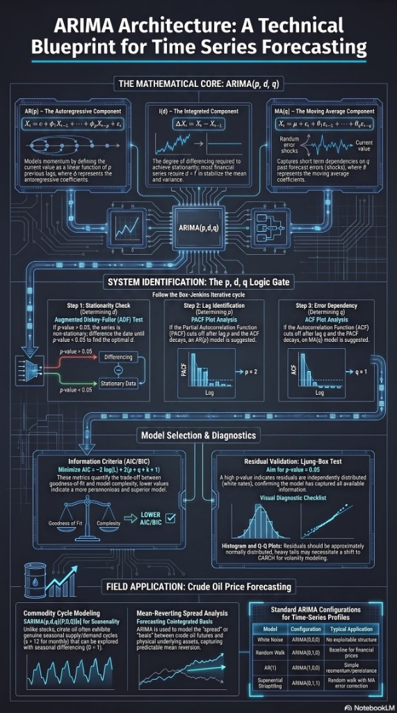

# ARIMA

One of the oldest forecasting algorithms still worth knowing.

ARIMA is probably one of the oldest forecasting algorithms that is still worth knowing.

Not because it beats modern deep learning models. But because it solves a surprisingly large number of business problems with very little data.

ARIMA (AutoRegressive Integrated Moving Average) models a time series using its own historical values and previous forecast errors. Unlike many machine learning approaches, it does not require dozens of external features or millions of observations.

It works best when:

• The data has a clear temporal structure.
 • Historical patterns are more important than external events.
 • Interpretability matters.
 • You need a reliable baseline before trying more complex models.

Typical use cases include:

Price predictions

Transaction volume prediction

CPU and memory utilization

Energy consumption

Network traffic

Inventory planning

Payment system load forecasting

For software architects, ARIMA is particularly interesting because it is inexpensive to operate.

A typical forecasting pipeline is surprisingly simple:

Time Series → Data Cleaning → Stationarity Check → ARIMA Model → Forecast → Monitoring

If seasonality exists, SARIMA extends the same idea by explicitly modeling repeating seasonal patterns such as hourly, weekly, or yearly cycles.

One lesson I've learned is that not every forecasting problem needs an LLM or a neural network.

If a statistical model explains the data well, trains in seconds, and can be understood by the business, it is often the better engineering choice.

As architects, we should start with the simplest model that answers the business question and only increase complexity when the data proves it is necessary.

And since this is the algorithm I used for my Master degree final project I feel personally connected to it!

## Related notes

- [ML Algorithms](ml-algorithms.md)
- [Overfitting in Business](overfitting-in-business.md)
- [SHAP](shap.md)

---

*Originally published on [LinkedIn](https://www.linkedin.com/feed/update/urn:li:activity:7489653053290315776/), 2 August 2026.*
