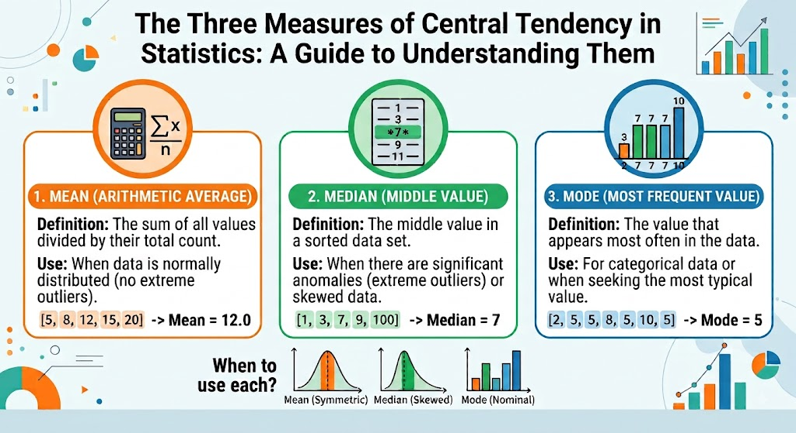

# The Three Measures of Central Tendency

A guide to understanding mean, median, and mode.

Today the National Statistical Institute (NSI) of Bulgaria released its report on average wages and salaries for the second quarter of 2026: an average gross monthly wage of €1,444, up 2.6% from the first quarter and up 9.8% from a year earlier. The highest-paid sector, information and communication, averaged €3,079 a month; the lowest, accommodation and food service, averaged €918 — nearly a 3.4x gap between the two.

As usual, we read replies like "Where do I apply?"; "Who is earning that much?" And many more. Basically always the same. What I find really frustrating is when someone repeats a very common misconception about the arithmetic mean. There's a saying in Bulgaria that sums it up perfectly: "I eat sauerkraut, you eat pork meat. Together we are having sauerkraut with pork meat." It gets me every time I read it. If one opposes that person, one gets, "It's figuratively speaking." No, it is not figuratively speaking. It demonstrates a fundamental lack of basic statistics knowledge. And that gap is exactly why headlines like the NSI's always spark the wrong conversation.

So why isn't the average what actually lands in your bank account each month? Look at the numbers. As of May 2026, only 310,340 people in Bulgaria are insured at the maximum insurable income threshold, which now stands at €2,300 a month. Out of a total workforce of over 2 million, that's a small slice at the top. Meanwhile, hundreds of thousands sit at or near the minimum wage. The average doesn't describe either of these groups — it describes a number that exists only when you add everyone's income together and divide by the headcount. It's not a lie, but it's not "typical" either. That's why the median, not the mean, is the number that actually reflects what most people take home.

The truth is, we lose almost all the underlying information the moment we calculate an arithmetic mean. A single number can't tell you about the low earners, the high earners, or the shape of the distribution in between — it flattens everyone into one figure. That's exactly why the average shouldn't be read as "what people earn." Its real value is as a tracked indicator over time: watching how it moves quarter to quarter, year to year, tells us whether wages are trending up or down, even if it can't tell us who's actually feeling that change.

Mode adds another layer to this. In Bulgaria, the single most common salary is very likely the minimum wage itself, since so many people are clustered right at that figure. Mean tells you the mathematical average, median tells you the midpoint, and mode tells you the one number that describes more people than any other. None of the three is "wrong" — they just answer different questions. The mistake is treating the mean as if it answers all three at once.

Here's the thing, though: NSI doesn't publish the wage mode in its quarterly releases. You won't find it next to the average in any press release, because it's not the number that flatters a growing economy narrative. But if you plotted the actual wage distribution, you'd very likely see a sharp spike right around the minimum wage line, then a long, thinning tail stretching out toward the high earners. That spike is the mode, and it's arguably the most honest single number in the whole dataset — because it tells you, quite literally, what "a normal salary" looks like for the largest single group of people in the country. It's just not the number anyone puts in a headline.

And that's really the crux of the whole confusion. When people say "average salary," what they actually mean, intuitively, is "normal salary" — the number that describes someone like them, or someone they'd recognize as an ordinary worker. But the arithmetic mean was never built to answer that question. It answers a completely different one: what would everyone's paycheck look like if the country's entire wage bill were split evenly across every employee? That's a useful number for economists tracking aggregate labor costs. It is not a useful number for a person trying to figure out whether their own salary is typical.

The mode, messy and unofficial as it is, comes far closer to what people actually mean when they ask "am I earning a normal salary?" It doesn't get inflated by the handful of people in IT pulling in €3,079 a month, and it doesn't get distorted by pooling everyone's income into one artificial total. It simply asks: what does the largest group of people around you actually take home? For a huge share of the Bulgarian workforce, the honest answer to that question is closer to the minimum wage than to the €1,444 figure NSI just published — and that gap, more than anything, is why the sauerkraut-and-pork-meat joke keeps landing the way it does.

In the end, the disagreement over what "average" means is not a matter of opinion — it is a matter of definition. The arithmetic mean, the median, and the mode are three distinct measures of central tendency, each mathematically well-defined, each answering a different question about a distribution, and none of them interchangeable with the colloquial notion of "typical." When a distribution is symmetric, the three converge and the distinction is academic. Wage distributions are not symmetric. They are right-skewed by construction, bounded below by a legal minimum and unbounded above, which is precisely why the mean sits above the median, and why the median in turn sits above the mode. Reporting the mean without acknowledging the shape of the underlying distribution is not incorrect, but it is incomplete — and incompleteness, in public discourse, is routinely mistaken for deception. It is not deception. It is simply statistics being read by people who were never taught how to read it. That, and not the NSI, is the actual subject of this piece.

## Related notes

- [Overfitting in Business](overfitting-in-business.md)
- [ML Algorithms](ml-algorithms.md)
- [Clustering](clustering.md)

Here you can find the NSI publication from today: [Employees and average wages and salaries — Second quarter of 2026](https://www.nsi.bg/en/press-release/employees-and-average-wages-and-salaries-9113)

---

*12 August 2026.*
