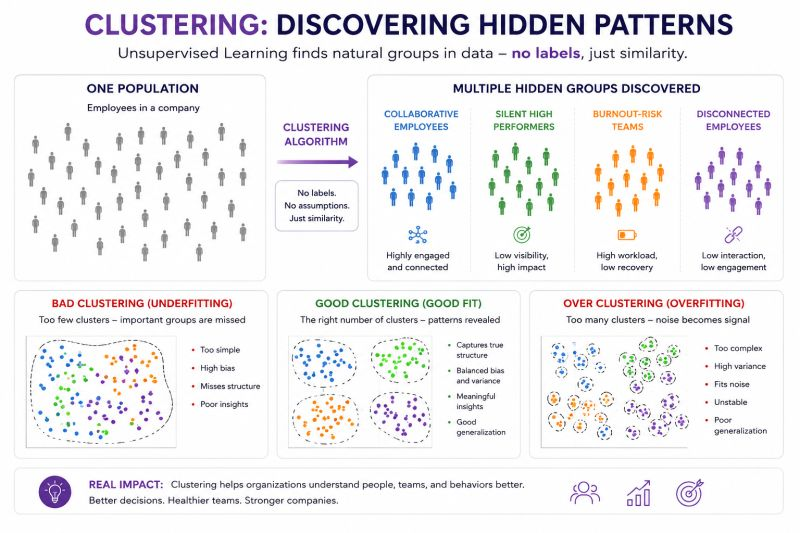

# Clustering

Discovering hidden patterns — no labels, just similarity.

📊 Clustering algorithms are fascinating because they can discover patterns without being told what to look for.

Imagine a company analyzing employee behavior, communication, workload, and performance trends.

Without predefined labels, the model starts forming groups:

* highly collaborative employees
* silent high performers
* burnout-risk teams
* people disconnected from the organization

No one manually created these categories.

The algorithm found them through similarity in behavior.

That's the essence of Clustering and Unsupervised Learning.

Sometimes the most valuable insight in AI is not prediction.

It's discovering what humans failed to notice inside the data.

## Related notes

- [K-Nearest Neighbors](knn.md)
- [ML Algorithms](ml-algorithms.md)

---

*Originally published on [LinkedIn](https://www.linkedin.com/feed/update/urn:li:activity:7464929377953378304/), 26 May 2026.*
