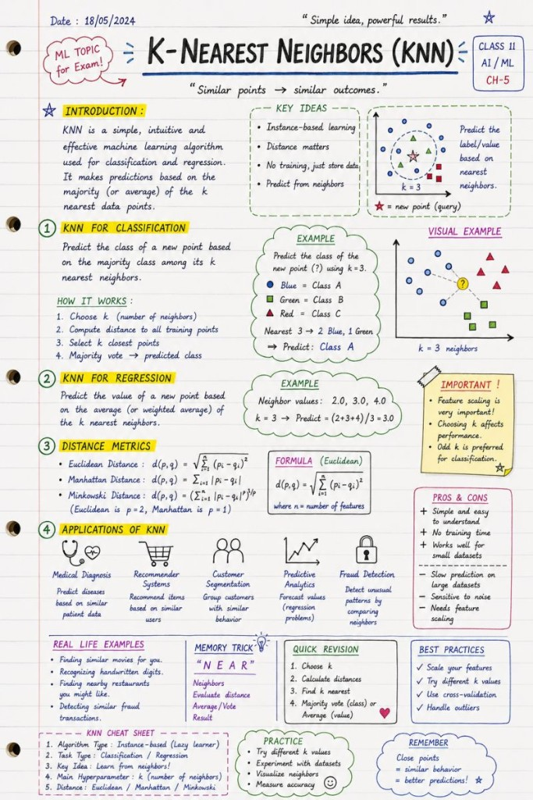

# K-Nearest Neighbors

Similar things tend to behave similarly.

🚀 Machine Learning doesn't have to look scary.

One of the best ways to explain AI concepts is through visuals, intuition, and real-world examples.

 Here's a hand-drawn style breakdown of one of the most beginner-friendly ML algorithms:

🧠 K-Nearest Neighbors (KNN)

What makes KNN interesting?

 ✅ No heavy "training" phase

 ✅ Learns from similarity between data points

 ✅ Used for both classification & regression

 ✅ Powers recommendation systems, fraud detection, medical predictions, customer segmentation and more

💡 The core idea is surprisingly human:

"Similar things tend to behave similarly."

If you can understand:

 📍 distance

 📍 neighbors

 📍 voting / averaging

…you already understand the foundation of KNN.

I strongly believe AI education becomes far more effective when concepts are visual, structured and connected to real applications instead of only equations and theory.

This is especially important when teaching:

students

junior developers

non-technical professionals

future AI practitioners

Because understanding why a model works matters more than memorizing formulas.

## Related notes

- [Clustering](clustering.md)
- [ML Algorithms](ml-algorithms.md)

---

*Originally published on [LinkedIn](https://www.linkedin.com/feed/update/urn:li:activity:7465271824705044480/), 27 May 2026.*
