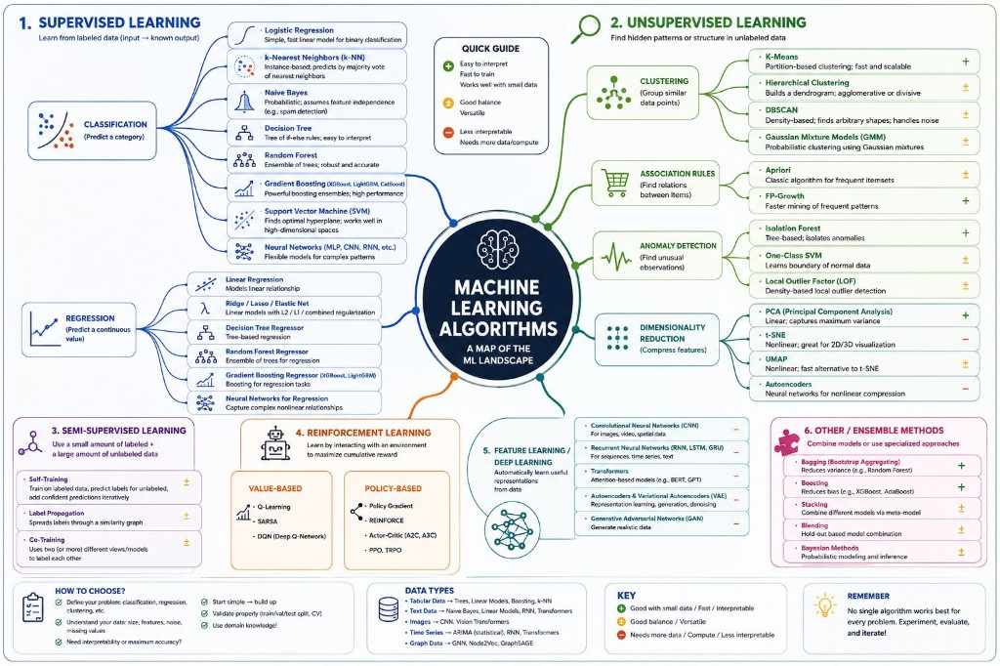

# ML Algorithms

Besides the architecture topics I am really excited about ML algorithms. One of my personally favourite is ARIMA. I used it long time ago for Master degree final project. At the time the current version of Java was 8 :) I remember that since I implemented the algorithm using R and connected the code with Java. That was a huge issue since R is a script language and Java is OOP. On the top of that I used JavaFX which was brand new at the time. Exciting times to write code.

Today I still stick with these algorithms and the exciting part is that we already deal with new algorithms that remove the limitations introduced by the old ones.

## Related notes

- [Clustering](clustering.md)
- [K-Nearest Neighbors](knn.md)
- [SHAP](shap.md)

---

*Originally published on [LinkedIn](https://www.linkedin.com/feed/update/urn:li:activity:7485596125387845632/), 22 July 2026.*
