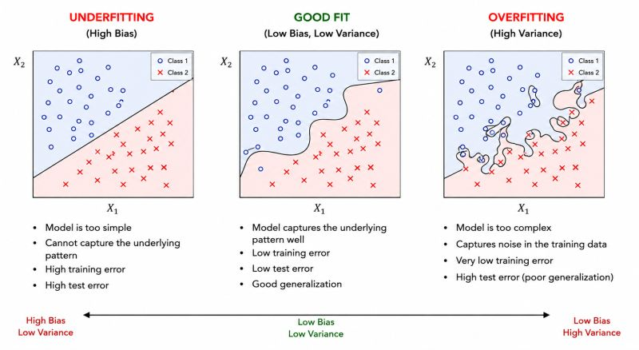

# Overfitting in Business

Signal vs noise — when models memorize instead of learn.

Overfitted models can be dangerous in business. 🤯

They may identify correlations that look convincing in historical data but fail completely in reality.

That's how organizations end up firing employees for 'low efficiency' when the actual issue is understaffing, process bottlenecks, or unrealistic workload distribution.

Machine learning is not just about accuracy. ✅

It's about understanding whether the model learned the signal — or merely memorized the noise.

---

*Originally published on [LinkedIn](https://www.linkedin.com/feed/update/urn:li:activity:7463895318825451520/), 23 May 2026.*
