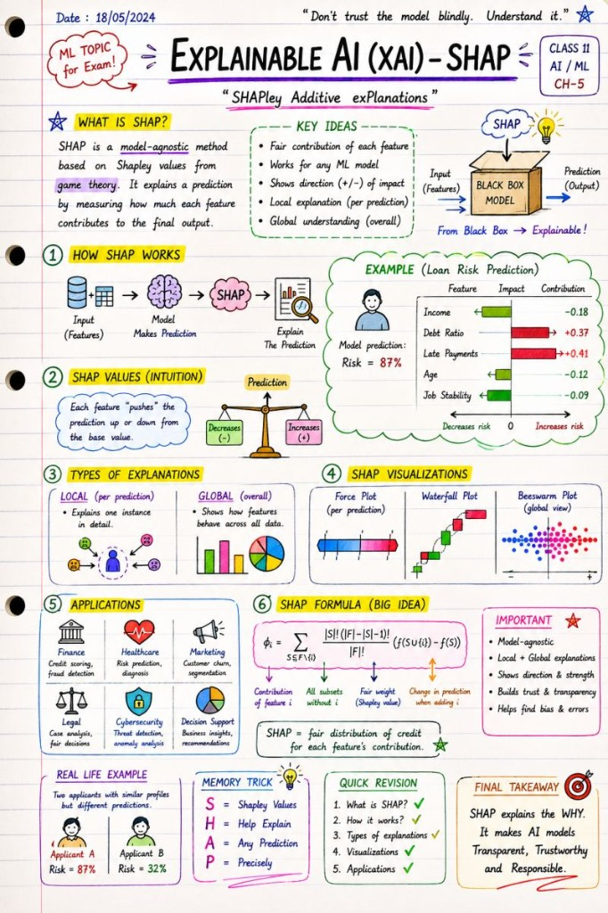

# SHAP

Explainable AI — from black box to inspectable predictions.

🧠 Most people stop at:

 "AI predicted X."

But the real question is:

 👉 WHY did the model predict X?

This is where Explainable AI (XAI) becomes critical.

Today's topic:

 🔍 SHAP (SHapley Additive Explanations)

SHAP helps us understand:

 ✅ which features influenced a prediction

 ✅ how strongly they influenced it

 ✅ whether they pushed the prediction up or down

 ✅ why the model behaves differently for different cases

In other words:

 SHAP turns ML models from a black box into something humans can actually inspect and trust.

📌 Example:

 A risk prediction model says:

"This customer has 87% risk."

SHAP can reveal:

Income → decreased risk

Debt ratio → increased risk

Late payments → strongly increased risk

Long customer history → reduced risk

Now we are no longer blindly trusting AI.

 We are analyzing its reasoning.

And honestly?

 This is one of the most important directions in modern AI:

 ⚖️ transparency

 ⚖️ trust

 ⚖️ interpretability

 ⚖️ responsible AI

Especially in:

 🏦 finance

 🏥 healthcare

 ⚖️ legal systems

 🛡️ cybersecurity

 📊 decision support systems

Because if humans cannot explain a prediction…

 should we really trust it?

---

*Originally published on [LinkedIn](https://www.linkedin.com/feed/update/urn:li:activity:7465619831623462912/), 28 May 2026.*
